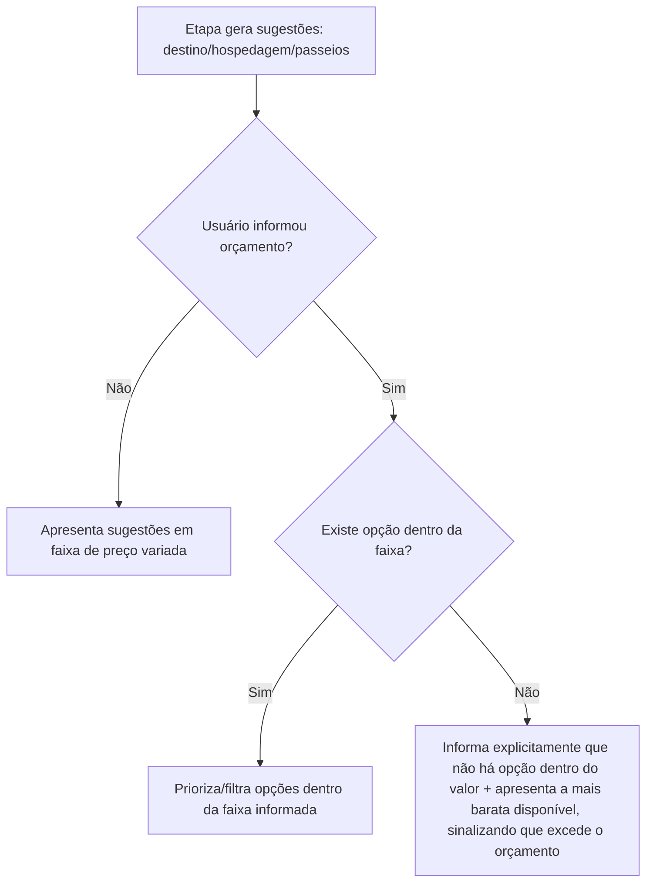
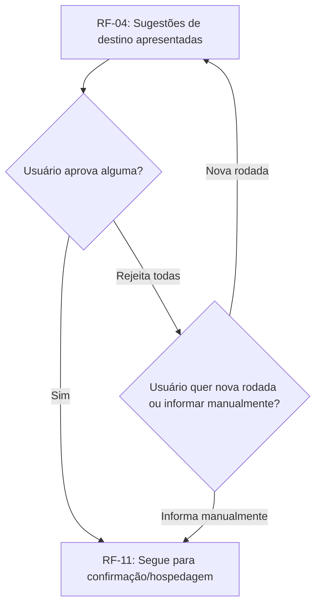

# PRD-TECNICO.md — Planejador de Viagens com Decisão Guiada por IA

Autor: Gestor (chapéu Business Analyst). Baseado em `PRD.md` (2026-09-07).
Cobre exclusivamente o escopo do MVP (Fase 1 — Decisão guiada), conforme Seção 4
do `PRD.md`. Requisitos de Fase 2 aparecem apenas onde necessário para viabilizar
a dependência declarada em `PRD.md` Seção 7, pergunta 2 (formato de saída da
Fase 1), sem detalhar a Fase 2 em si — isso é objeto de um `PRD-TECNICO.md` de
release subsequente.

## 1. Requisitos Funcionais

Formato de critério de aceite: EARS (Easy Approach to Requirements Syntax).

### RF-01 — Entrada por data livre
**Origem:** R1 do PRD.md.
- RF-01.1: QUANDO o usuário seleciona o caminho "Data livre", O SISTEMA DEVE
  solicitar um range de datas (início e fim).
- RF-01.2: QUANDO o usuário informa o range de datas e NÃO informa destino, O
  SISTEMA DEVE seguir para RF-04 (sugestão de destino por sazonalidade).
- RF-01.3: QUANDO o usuário informa o range de datas E informa destino, O
  SISTEMA DEVE pular RF-04 e seguir direto para RF-06 (sugestão de hospedagem),
  registrando o destino informado como aprovado (ver Interpretação INT-01, Seção
  7).
- RF-01.4: SE a data final informada for anterior à data inicial, ENTÃO O
  SISTEMA DEVE rejeitar a entrada com mensagem de erro explícita, sem avançar de
  etapa.

### RF-02 — Entrada por feriados prolongados
**Origem:** R2 do PRD.md.
- RF-02.1: QUANDO o usuário seleciona o caminho "Feriados prolongados", O
  SISTEMA DEVE apresentar uma listagem de feriados nacionais brasileiros do ano
  corrente e do ano seguinte, cada um indicando a emenda calculada com fins de
  semana adjacentes (ex.: feriado em quinta-feira mostra a emenda até domingo).
- RF-02.2: O SISTEMA DEVE calcular a emenda automaticamente a partir da data do
  feriado e do dia da semana em que cai, sem exigir input manual do usuário.
- RF-02.3: QUANDO o usuário escolhe um feriado da listagem, O SISTEMA DEVE tratar
  o range resultante (feriado + emenda) como equivalente ao range de datas de
  RF-01, seguindo a mesma ramificação de RF-01.2/RF-01.3 conforme destino
  informado ou não.
- RF-02.4: O SISTEMA NÃO DEVE incluir feriados de outros países na listagem do
  MVP (fora de escopo, conforme PRD.md Seção 4).

### RF-03 — Entrada por quiz guiado
**Origem:** R3 do PRD.md; resolve a Pergunta em Aberto 1 do PRD.md Seção 7 (ver
Interpretação INT-02, Seção 7).
- RF-03.1: QUANDO o usuário seleciona o caminho "Quiz guiado", O SISTEMA DEVE
  apresentar um conjunto fixo de perguntas básicas, nesta ordem: (1) período
  disponível aproximado (ex.: fim de semana, 3-5 dias, 1 semana, mais de 1
  semana); (2) alcance geográfico desejado (Brasil, América do Sul, EUA,
  Europa, ou "sem preferência"); (3) tipo de experiência preferida (praia,
  cidade/urbano, natureza/aventura, cultura/história, ou combinação); (4)
  orçamento disponível (opcional, texto livre em faixa de valor).
- RF-03.2: AO final das perguntas, O SISTEMA DEVE gerar um range de datas
  sugerido (com base no período informado, priorizando o feriado prolongado mais
  próximo compatível, se houver) e seguir para RF-04.
- RF-03.3: O SISTEMA DEVE permitir que o usuário pule qualquer pergunta não
  obrigatória (alcance geográfico e tipo de experiência podem ficar "sem
  preferência"; período é obrigatório).

### RF-04 — Sugestão de destino por sazonalidade
**Origem:** R4 do PRD.md.
- RF-04.1: QUANDO o sistema chega a esta etapa sem destino definido, O SISTEMA
  DEVE gerar de 2 a 4 sugestões de destino, cada uma com: nome do destino,
  justificativa curta de por que é adequado à época do ano informada, e faixa de
  preço aproximada estimada para a viagem completa.
- RF-04.2: SE o usuário informou orçamento (RF-03.1 item 4, ou informado nesta
  etapa), ENTÃO O SISTEMA DEVE filtrar/priorizar sugestões de destino compatíveis
  com a faixa informada, conforme RF-10.
- RF-04.3: QUANDO o usuário aprova um destino sugerido, O SISTEMA DEVE avançar
  para RF-06 (hospedagem).
- RF-04.4: QUANDO o usuário rejeita todas as sugestões apresentadas, O SISTEMA
  DEVE permitir gerar uma nova rodada de sugestões ou permitir que o usuário
  informe um destino manualmente.
- RF-04.5: QUANDO o usuário aprova um destino, mas indica que não quer prosseguir
  para as próximas etapas (hospedagem/passeios/roteiro), O SISTEMA DEVE permitir
  encerrar a sessão nesse ponto sem erro, preservando o destino aprovado como
  resultado utilizável (ver RF-09 dependência com Fase 2).

### RF-05 — Fluxo de sugestão em etapas
**Origem:** R5 do PRD.md.
- RF-05.1: O SISTEMA DEVE apresentar as sugestões em sequência fixa de etapas:
  destino (se aplicável) → hospedagem → passeios/atividades → roteiro final —
  nunca todas de uma vez na mesma resposta.
- RF-05.2: QUANDO o usuário aprova uma etapa, O SISTEMA DEVE avançar para a
  etapa seguinte automaticamente, sem exigir ação adicional além da aprovação.
- RF-05.3: QUANDO o usuário solicita ajuste em uma etapa (em vez de aprovar), O
  SISTEMA DEVE gerar uma nova sugestão para a mesma etapa, incorporando o
  feedback do usuário, sem avançar para a etapa seguinte.
- RF-05.4: O SISTEMA DEVE permitir que o usuário encerre a sessão aprovando
  apenas um subconjunto de etapas (ex.: só destino), preservando o que já foi
  aprovado até aquele ponto (ver RF-04.5).

### RF-06 — Sugestão de hospedagem
**Origem:** R7 do PRD.md.
- RF-06.1: QUANDO o sistema chega a esta etapa, O SISTEMA DEVE gerar 3 opções
  de hospedagem, cada uma com: nome/tipo (ex.: hotel, pousada, hostel), faixa de
  preço aproximada por diária, e uma característica distintiva (ex.: localização,
  categoria).
- RF-06.2: SE o usuário informou orçamento, ENTÃO as opções apresentadas DEVEM
  respeitar RF-10 (filtro de orçamento).
- RF-06.3: QUANDO o usuário aprova uma opção de hospedagem, O SISTEMA DEVE
  avançar para RF-07 (passeios).

### RF-07 — Sugestão de passeios/atividades
**Origem:** R8 do PRD.md.
- RF-07.1: QUANDO o sistema chega a esta etapa, O SISTEMA DEVE gerar uma lista
  de passeios/atividades compatíveis com o destino e o período, cada um com:
  nome, faixa de preço (podendo ser R$ 0 para opções gratuitas), e duração
  aproximada.
- RF-07.2: O SISTEMA DEVE incluir pelo menos uma opção gratuita na lista sempre
  que existir uma opção gratuita relevante ao destino.
- RF-07.3: QUANDO o usuário aprova o conjunto de passeios (podendo remover itens
  individuais da lista sugerida antes de aprovar), O SISTEMA DEVE avançar para
  RF-08 (roteiro final).

### RF-08 — Roteiro final
**Origem:** R9 do PRD.md.
- RF-08.1: QUANDO o sistema chega a esta etapa, O SISTEMA DEVE organizar os
  passeios aprovados (RF-07) em um roteiro estruturado por dia, dividido em pelo
  menos manhã/tarde/noite, dentro do range de datas da viagem.
- RF-08.2: O SISTEMA DEVE sequenciar as atividades otimizando por proximidade
  geográfica dentro do destino e por horário ideal de cada atividade (RF-08.3),
  evitando deslocamentos redundantes entre pontos distantes no mesmo período do
  dia sempre que uma alternativa de sequenciamento equivalente existir.
- RF-08.3: PARA CADA atividade no roteiro, O SISTEMA DEVE indicar um horário
  sugerido de execução, com uma justificativa curta quando o horário for
  relevante para a experiência (ex.: "evitar fila", "evitar calor", "evitar
  lotação").
- RF-08.4: QUANDO o usuário aprova o roteiro final, O SISTEMA DEVE marcar a
  sessão de decisão guiada como concluída e disponibilizar o resultado
  estruturado conforme RF-09.

### RF-09 — Estrutura de saída para consumo futuro pela Fase 2
**Origem:** Pergunta em Aberto 2 do PRD.md Seção 7 (ver Interpretação INT-03,
Seção 7). Este requisito não implementa a Fase 2 — só garante que o dado gerado
pela Fase 1 é armazenado num formato reaproveitável, requisito deste MVP.
- RF-09.1: O SISTEMA DEVE persistir, para cada sessão de decisão guiada com pelo
  menos uma etapa aprovada, um registro estruturado contendo: destino aprovado
  (se houver), range de datas, hospedagem aprovada (se houver), lista de
  passeios aprovados com data/horário do roteiro (se houver), e faixa de
  orçamento informada (se houver) — cada campo é independentemente opcional,
  refletindo que o usuário pode ter aprovado só um subconjunto de etapas.
- RF-09.2: O formato de persistência de RF-09.1 é definido pelo Coordenador no
  SDD.md (schema de dados); este requisito só define o conteúdo mínimo
  obrigatório, não o formato técnico.

### RF-10 — Orçamento como filtro de entrada
**Origem:** R10 do PRD.md; resolve a Pergunta em Aberto 4 do PRD.md Seção 7 (ver
Interpretação INT-04, Seção 7).
- RF-10.1: SE o usuário informa um valor de orçamento disponível (em qualquer
  etapa em que a pergunta seja apresentada), ENTÃO O SISTEMA DEVE usar esse valor
  para priorizar/filtrar as sugestões de destino, hospedagem e passeios dentro
  da faixa informada.
- RF-10.2: SE nenhuma opção estiver dentro da faixa de orçamento informada,
  ENTÃO O SISTEMA DEVE informar explicitamente ao usuário que não há opção
  dentro do valor indicado, e apresentar a opção disponível mais próxima (mais
  barata) como alternativa, deixando claro que ela excede o orçamento informado.
- RF-10.3: O SISTEMA NÃO DEVE bloquear o fluxo quando o orçamento não for
  informado — todas as etapas funcionam normalmente sem esse filtro, apresentando
  sugestões em faixa de preço variada.

### RF-11 — Confirmação de destino já informado
**Origem:** Pergunta em Aberto 3 do PRD.md Seção 7 (ver Interpretação INT-01,
Seção 7).
- RF-11.1: QUANDO o usuário informa um destino já decidido (RF-01.3), O SISTEMA
  DEVE apresentar uma etapa curta de confirmação (exibindo o destino informado e
  pedindo confirmação explícita) antes de avançar para RF-06, em vez de pular
  direto sem qualquer checkpoint — mantém a mesma lógica de "aprovação por etapa"
  (RF-05) aplicada de forma consistente também quando o destino não veio de uma
  sugestão da IA.

## 2. Requisitos Não-Funcionais

| ID | Requisito | Categoria |
|---|---|---|
| RNF-01 | Toda sugestão de preço exibida na interface DEVE ser rotulada explicitamente como "faixa aproximada" (ou equivalente visual), nunca apresentada como preço confirmado/reservável, para gerenciar expectativa do usuário (resolve premissa P-02 do PRD.md) | Usabilidade / Confiabilidade percebida |
| RNF-02 | O tempo de resposta de cada etapa de sugestão (destino, hospedagem, passeios, roteiro) DEVE ficar dentro de um limite que não quebre a percepção de fluidez do fluxo guiado — o Coordenador define o valor numérico no SDD.md com base no provider de LLM escolhido, mas o requisito de "não travar a experiência guiada" é deste documento | Performance |
| RNF-03 | A interface web DEVE seguir um padrão visual cuidado e consistente, tratado como requisito funcional de primeira classe (não incidental) — critério de aceite qualitativo a ser detalhado em `UX-SPEC.md` pelo Coordenador | Usabilidade |
| RNF-04 | O sistema DEVE ser responsivo (funcional em desktop e mobile via navegador), já que o fluxo guiado pode ser usado em qualquer contexto de planejamento (decisão de stack de PWA/nativo cabe ao Coordenador) | Compatibilidade |
| RNF-05 | Toda chamada ao provider de LLM DEVE ter tratamento de falha (timeout, erro, resposta malformada) que não quebre a sessão do usuário — pelo menos uma tentativa de nova geração antes de expor erro ao usuário | Confiabilidade |
| RNF-06 | O sistema DEVE armazenar dados pessoais do usuário (quando aplicável, ex.: e-mail de conta) em conformidade com LGPD — requisito mínimo deste MVP, mesmo sem funcionalidade de conta social/terceiros ainda definida | Compliance |
| RNF-07 | O cálculo de emenda de feriados (RF-02.2) DEVE ser determinístico e não depender de chamada a LLM — é lógica de calendário, não geração de conteúdo | Confiabilidade |

## 3. Regras de Negócio

| ID | Regra | Racional |
|---|---|---|
| RN-01 | O fluxo de sugestão nunca apresenta duas ou mais etapas (destino, hospedagem, passeios, roteiro) na mesma resposta/tela | Diferencial de UX central do produto (PRD.md R5); apresentar tudo de uma vez tira do usuário a chance de aprovar/ajustar cada parte isoladamente |
| RN-02 | O calendário de feriados prolongados considera exclusivamente feriados nacionais brasileiros | Escopo do MVP definido no PRD.md Seção 4; feriados internacionais ficam para release futura |
| RN-03 | Uma sessão de decisão guiada pode ser considerada "concluída com valor" mesmo que o usuário aprove só uma etapa (ex.: só destino) | Reflete diretamente a motivação de produto declarada no briefing: "a pessoa pode querer usar apenas uma parte da experiência" |
| RN-04 | O orçamento informado pelo usuário nunca bloqueia o fluxo — funciona só como filtro/priorização, nunca como impeditivo de avançar | RF-10.3; garante que a ausência ou insuficiência de orçamento não trava a experiência guiada |
| RN-05 | Toda faixa de preço exibida ao usuário é rotulada como aproximada, nunca como cotação confirmada | Não há integração de preço real no MVP (PRD.md Seção 4); rotular incorretamente geraria expectativa que o produto não pode cumprir |
| RN-06 | O quiz guiado (RF-03) não é expandido além do conjunto de 4 perguntas básicas definidas neste documento sem passar por uma nova rodada de validação de uso real | PRD.md R-03; decisão consciente do fundador de não fazer design especulativo de perguntas adicionais |

## 4. Fluxos de Usuário/Processo

### Fluxo principal — visão geral (com os três caminhos de entrada convergindo)

### Ponto de decisão: orçamento como filtro (RF-10)

### Caminho alternativo: rejeição total das sugestões de destino (RF-04.4)

## 5. Dependências entre Requisitos e Integrações Externas

### Dependências internas
| Requisito dependente | Depende de | Natureza da dependência |
|---|---|---|
| RF-04 (sugestão de destino) | RF-01/RF-02/RF-03 (algum caminho de entrada concluído sem destino) | Bloqueante: RF-04 só é acionado se nenhum caminho de entrada já resolveu o destino |
| RF-06 (hospedagem) | RF-04 aprovado OU RF-11 confirmado | Bloqueante: não há sugestão de hospedagem sem destino resolvido |
| RF-07 (passeios) | RF-06 aprovado | Bloqueante, conforme RN-01 (fluxo em etapas estrito) |
| RF-08 (roteiro) | RF-07 aprovado | Bloqueante, idem |
| RF-08.2 (otimização de sequência) | RF-08.3 (horário ideal por atividade) | Funcional: a otimização de sequência usa o horário ideal como um dos critérios de ordenação |
| RF-09 (persistência estruturada) | Qualquer etapa aprovada (RF-04, RF-06, RF-07 ou RF-08) | Cada etapa aprovada individualmente já é suficiente para acionar RF-09 com os campos correspondentes preenchidos, conforme RN-03 |
| RF-10 (filtro de orçamento) | RF-03.1(4) OU input de orçamento em outra etapa | Condicional: só se aplica se o valor foi informado em algum ponto |
| RF-02.3 (feriado como range de datas) | RF-02.2 (cálculo de emenda) | Bloqueante: a listagem de feriados só pode ser escolhida depois de calculada a emenda |

### Integrações externas necessárias
| Integração | Propósito | Observação de escopo |
|---|---|---|
| Provider de LLM (a definir no SDD.md pelo Coordenador) | Geração de sugestões de destino, hospedagem, passeios, roteiro e faixas de preço aproximadas (RF-04, RF-06, RF-07, RF-08) | Núcleo do diferencial de produto; tratamento de custo/fallback/alucinação é decisão de arquitetura de primeira classe, conforme ressalva do Gate 1 em CTO-REVIEW.md |
| Fonte de dados de feriados nacionais brasileiros | Base para a listagem de RF-02 | Pode ser calculado internamente (regra de calendário + feriados fixos/móveis conhecidos) ou via biblioteca/API de terceiros — decisão técnica do Coordenador; requisito de negócio é só a precisão do cálculo (RNF-07) |
| Nenhuma API de preço real de voo/hotel/passeio | Fora de escopo do MVP (PRD.md Seção 4) | Não é integração deste MVP; registrado aqui só para deixar explícito que não há dependência externa de preço real |

## 6. Premissas e Riscos Resolvidos

| ID (origem PRD.md) | Premissa/Risco | Validação/Refutação | Evidência citada |
|---|---|---|---|
| P-02 | Faixas de preço aproximadas são suficientemente úteis sem API de preço real | Validado como aceitável para o MVP, condicionado a RNF-01 (rotulagem explícita de "aproximado") | O próprio fundador já usa esse padrão manualmente hoje com IA generativa genérica, conforme briefing original — não é uma suposição nova, é prática já em uso |
| R-01 | Risco de alucinação de preço/informação pela LLM | Não eliminado (é um risco real de qualquer geração por LLM), mas mitigado por RNF-01 (rotulagem) e RNF-05 (tratamento de falha) neste documento; tratamento arquitetural completo (ex.: grounding, validação de faixa plausível) permanece como responsabilidade do Coordenador no SDD.md, conforme ressalva do Gate 1 | CTO-REVIEW.md, Gate 1, ressalva 1 |
| R-03 | Quiz guiado básico pode não cobrir casos reais suficientes | Não resolvido nesta etapa — mantido como risco aberto, deliberadamente, para ser avaliado só após uso real (RN-06 formaliza essa decisão de não expandir preventivamente) | PRD.md R-03, briefing original ("decisão adiada de propósito") |
| — | Ambiguidade: fluxo em etapas versus destino já informado precisa de checkpoint? | Resolvida: RF-11 introduz etapa de confirmação mesmo quando o destino já veio informado pelo usuário, para manter RN-01 consistente | Ver Interpretação INT-01, Seção 7 |

## 7. Interpretações Registradas

| ID | Ambiguidade original | Interpretação escolhida | Porquê |
|---|---|---|---|
| INT-01 | PRD.md Seção 7, pergunta 3: quando o destino já vem informado (pulando RF-04), o fluxo em etapas começa direto na hospedagem ou passa por uma confirmação antes? | Escolhido: passa por uma etapa curta de confirmação (RF-11) antes de avançar para hospedagem | Mantém RN-01/RF-05 consistentes em todos os casos — o princípio de "aprovação por etapa" declarado no PRD.md (R5) não deveria ter uma exceção silenciosa só porque o destino não veio de uma sugestão gerada pela IA; é uma interpretação de como aplicar um requisito já aceito, não uma mudança de escopo |
| INT-02 | PRD.md Seção 7, pergunta 1: qual o conjunto exato de perguntas do quiz guiado (R3)? | Escolhido um conjunto de 4 perguntas (período, alcance geográfico, tipo de experiência, orçamento opcional), detalhado em RF-03.1 | O briefing já apontava a intenção de "básico" e a decisão consciente de não expandir antes de testar (RN-06); um conjunto mínimo e coerente com as demais entradas (data + destino + orçamento, mesmos campos usados em RF-01/RF-04/RF-10) evita reinventar uma taxonomia de perguntas nova só para este caminho |
| INT-03 | PRD.md Seção 7, pergunta 2: que dado estruturado a Fase 1 precisa persistir para a Fase 2 reaproveitar? | Escolhido: persistir destino, range de datas, hospedagem, passeios com data/horário do roteiro e faixa de orçamento, cada campo opcional (RF-09.1), sem definir o schema técnico (isso é do Coordenador) | Resolve só o requisito de negócio ("o que precisa existir para a Fase 2 herdar isso depois"), sem antecipar decisão de arquitetura — mantém a fronteira entre BA e Software Architect (chapéu do Coordenador) |
| INT-04 | PRD.md Seção 7, pergunta 4: como tratar orçamento insuficiente para qualquer opção disponível? | Escolhido: informar explicitamente a incompatibilidade e oferecer a opção mais barata disponível como alternativa (RF-10.2), nunca bloquear o fluxo (RN-04) | Consistente com o objetivo de sucesso do PRD.md (taxa de conclusão do fluxo) — bloquear o usuário por causa de orçamento insuficiente aumentaria abandono sem necessidade; opção mais barata ainda entrega valor de decisão |
| INT-05 | PRD.md Seção 7, pergunta 5: o alcance geográfico do MVP é limitado aos quatro citados (Brasil, América do Sul, EUA, Europa), ou é aberto? | Escolhido: os quatro citados no briefing são tratados como as opções do quiz guiado (RF-03.1 item 2), mas não como um bloqueio rígido de destino em RF-04 — a sugestão de destino por sazonalidade não é restrita tecnicamente a essas quatro regiões, exceto quando o usuário escolhe uma delas explicitamente no quiz | O briefing usa essas quatro regiões como exemplo de "alcance geográfico que faz sentido" ao descrever o problema, não como uma lista exaustiva declarada de exclusão — tratar como exaustiva seria mudar o escopo do problema descrito na Seção 1 do PRD.md, o que não cabe a este chapéu decidir sozinho; ficou registrado aqui como interpretação de detalhe de UI do quiz, não como corte de escopo de produto |
