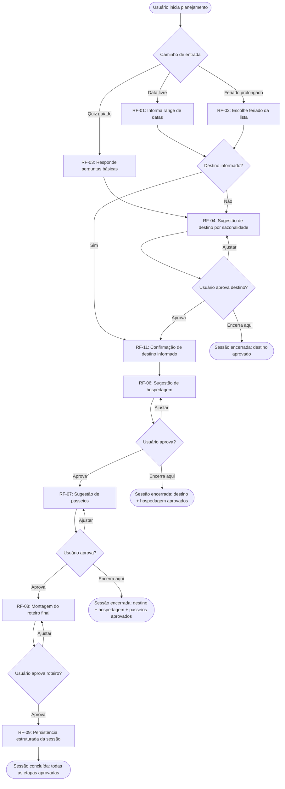
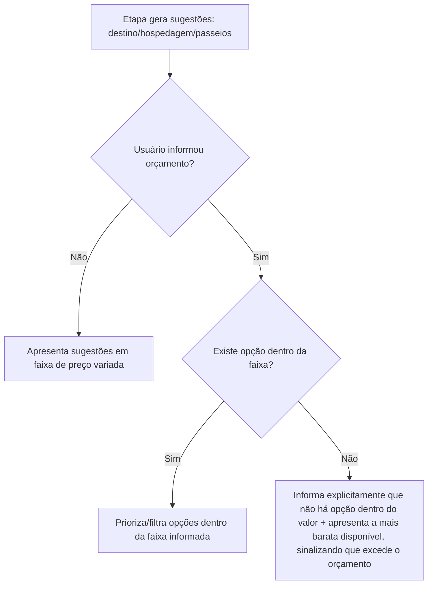
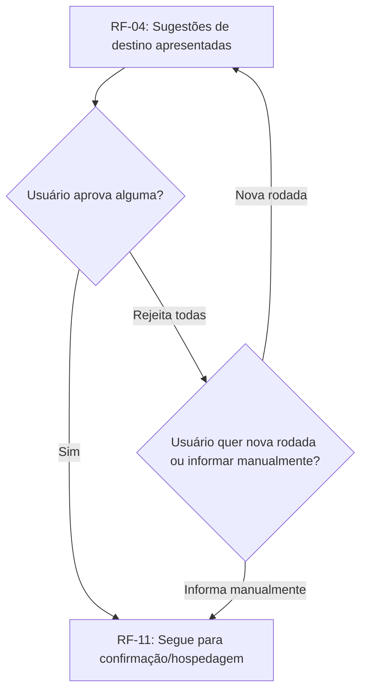
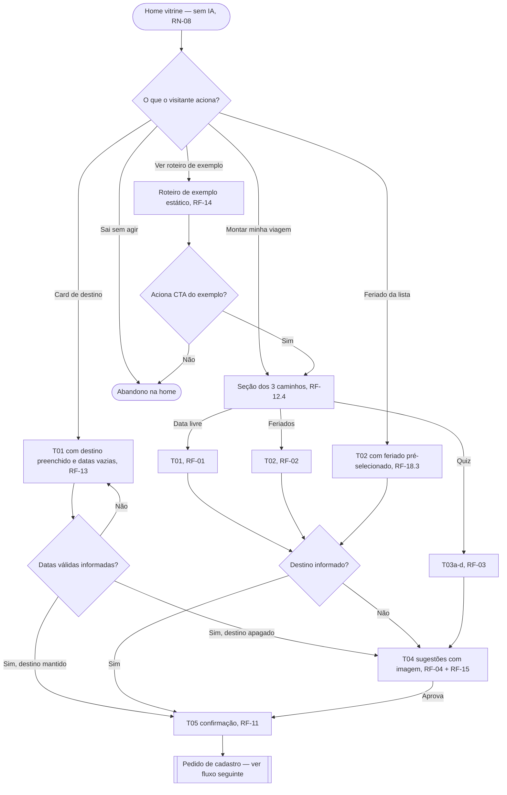
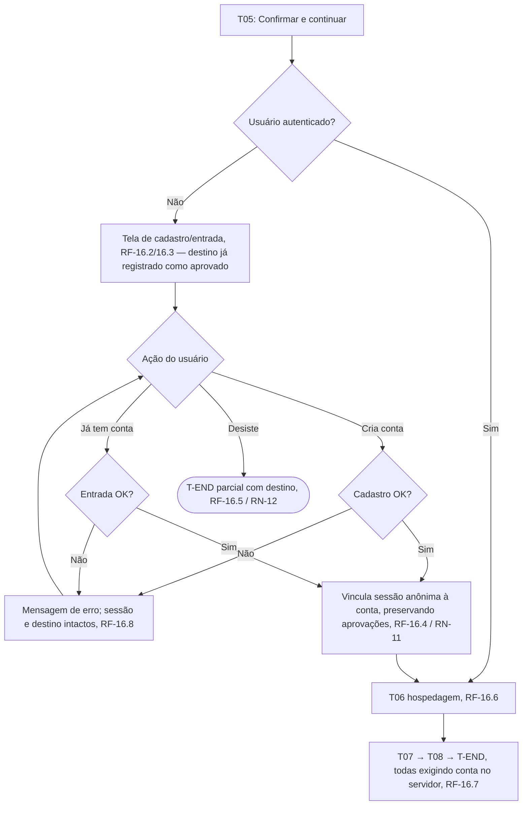
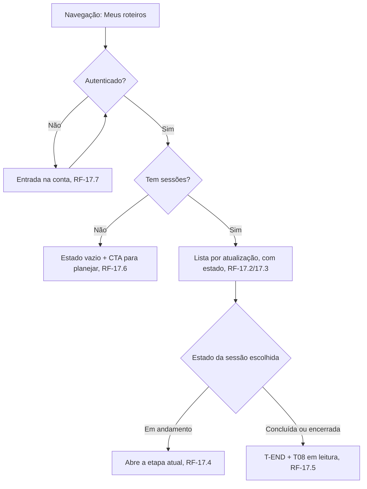
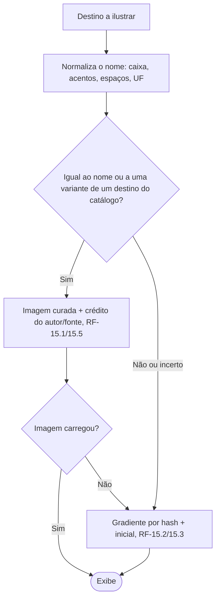

# PRD-TECNICO.md — Planejador de Viagens com Decisão Guiada por IA

Autor: Gestor (chapéu Business Analyst). Baseado em `PRD.md` (2026-09-07).
Cobre exclusivamente o escopo do MVP (Fase 1 — Decisão guiada), conforme Seção 4
do `PRD.md`. Requisitos de Fase 2 aparecem apenas onde necessário para viabilizar
a dependência declarada em `PRD.md` Seção 7, pergunta 2 (formato de saída da
Fase 1), sem detalhar a Fase 2 em si — isso é objeto de um `PRD-TECNICO.md` de
release subsequente.

**Atualização 2026-09-16 — V2.0 ("consultor de roteiros de viagem").** O
V2.0 foi aprovado para início (`PRD.md` Seção 4, "Plano do V2"). Esta
rodada acrescenta RF-12 a RF-18, RNF-08 a RNF-13, RN-07 a RN-12, os fluxos
do V2.0, as dependências e as interpretações INT-06 a INT-16. Os
requisitos do MVP (RF-01 a RF-11) continuam válidos. Onde o V2.0 altera
um comportamento do MVP, o requisito novo diz isso explicitamente. O
escopo do V2.1 e o "Fora do V2" do `PRD.md` não geram requisito aqui.

## 1. Requisitos Funcionais

Formato de critério de aceite: EARS (Easy Approach to Requirements Syntax).

### RF-01 — Entrada por data livre
**Origem:** R1 do PRD.md.
- RF-01.1: QUANDO o usuário seleciona o caminho "Data livre", O SISTEMA DEVE
  solicitar um range de datas (início e fim).
- RF-01.2: QUANDO o usuário informa o range de datas e NÃO informa destino, O
  SISTEMA DEVE seguir para RF-04 (sugestão de destino por sazonalidade).
- RF-01.3: QUANDO o usuário informa o range de datas E informa destino, O
  SISTEMA DEVE pular RF-04 e seguir direto para RF-06 (sugestão de hospedagem),
  registrando o destino informado como aprovado (ver Interpretação INT-01, Seção
  7).
- RF-01.4: SE a data final informada for anterior à data inicial, ENTÃO O
  SISTEMA DEVE rejeitar a entrada com mensagem de erro explícita, sem avançar de
  etapa.

### RF-02 — Entrada por feriados prolongados
**Origem:** R2 do PRD.md.
- RF-02.1: QUANDO o usuário seleciona o caminho "Feriados prolongados", O
  SISTEMA DEVE apresentar uma listagem de feriados nacionais brasileiros do ano
  corrente e do ano seguinte, cada um indicando a emenda calculada com fins de
  semana adjacentes (ex.: feriado em quinta-feira mostra a emenda até domingo).
- RF-02.2: O SISTEMA DEVE calcular a emenda automaticamente a partir da data do
  feriado e do dia da semana em que cai, sem exigir input manual do usuário.
- RF-02.3: QUANDO o usuário escolhe um feriado da listagem, O SISTEMA DEVE tratar
  o range resultante (feriado + emenda) como equivalente ao range de datas de
  RF-01, seguindo a mesma ramificação de RF-01.2/RF-01.3 conforme destino
  informado ou não.
- RF-02.4: O SISTEMA NÃO DEVE incluir feriados de outros países na listagem do
  MVP (fora de escopo, conforme PRD.md Seção 4).

### RF-03 — Entrada por quiz guiado
**Origem:** R3 do PRD.md; resolve a Pergunta em Aberto 1 do PRD.md Seção 7 (ver
Interpretação INT-02, Seção 7).
- RF-03.1: QUANDO o usuário seleciona o caminho "Quiz guiado", O SISTEMA DEVE
  apresentar um conjunto fixo de perguntas básicas, nesta ordem: (1) período
  disponível aproximado (ex.: fim de semana, 3-5 dias, 1 semana, mais de 1
  semana); (2) alcance geográfico desejado (Brasil, América do Sul, EUA,
  Europa, ou "sem preferência"); (3) tipo de experiência preferida (praia,
  cidade/urbano, natureza/aventura, cultura/história, ou combinação); (4)
  orçamento disponível (opcional, texto livre em faixa de valor).
- RF-03.2: AO final das perguntas, O SISTEMA DEVE gerar um range de datas
  sugerido (com base no período informado, priorizando o feriado prolongado mais
  próximo compatível, se houver) e seguir para RF-04.
- RF-03.3: O SISTEMA DEVE permitir que o usuário pule qualquer pergunta não
  obrigatória (alcance geográfico e tipo de experiência podem ficar "sem
  preferência"; período é obrigatório).

### RF-04 — Sugestão de destino por sazonalidade
**Origem:** R4 do PRD.md.
- RF-04.1: QUANDO o sistema chega a esta etapa sem destino definido, O SISTEMA
  DEVE gerar de 2 a 4 sugestões de destino, cada uma com: nome do destino,
  justificativa curta de por que é adequado à época do ano informada, e faixa de
  preço aproximada estimada para a viagem completa.
- RF-04.2: SE o usuário informou orçamento (RF-03.1 item 4, ou informado nesta
  etapa), ENTÃO O SISTEMA DEVE filtrar/priorizar sugestões de destino compatíveis
  com a faixa informada, conforme RF-10.
- RF-04.3: QUANDO o usuário aprova um destino sugerido, O SISTEMA DEVE avançar
  para RF-06 (hospedagem).
- RF-04.4: QUANDO o usuário rejeita todas as sugestões apresentadas, O SISTEMA
  DEVE permitir gerar uma nova rodada de sugestões ou permitir que o usuário
  informe um destino manualmente.
- RF-04.5: QUANDO o usuário aprova um destino, mas indica que não quer prosseguir
  para as próximas etapas (hospedagem/passeios/roteiro), O SISTEMA DEVE permitir
  encerrar a sessão nesse ponto sem erro, preservando o destino aprovado como
  resultado utilizável (ver RF-09 dependência com Fase 2).

### RF-05 — Fluxo de sugestão em etapas
**Origem:** R5 do PRD.md.
- RF-05.1: O SISTEMA DEVE apresentar as sugestões em sequência fixa de etapas:
  destino (se aplicável) → hospedagem → passeios/atividades → roteiro final —
  nunca todas de uma vez na mesma resposta.
- RF-05.2: QUANDO o usuário aprova uma etapa, O SISTEMA DEVE avançar para a
  etapa seguinte automaticamente, sem exigir ação adicional além da aprovação.
- RF-05.3: QUANDO o usuário solicita ajuste em uma etapa (em vez de aprovar), O
  SISTEMA DEVE gerar uma nova sugestão para a mesma etapa, incorporando o
  feedback do usuário, sem avançar para a etapa seguinte.
- RF-05.4: O SISTEMA DEVE permitir que o usuário encerre a sessão aprovando
  apenas um subconjunto de etapas (ex.: só destino), preservando o que já foi
  aprovado até aquele ponto (ver RF-04.5).

### RF-06 — Sugestão de hospedagem
**Origem:** R7 do PRD.md.
- RF-06.1: QUANDO o sistema chega a esta etapa, O SISTEMA DEVE gerar 3 opções
  de hospedagem, cada uma com: nome/tipo (ex.: hotel, pousada, hostel), faixa de
  preço aproximada por diária, e uma característica distintiva (ex.: localização,
  categoria).
- RF-06.2: SE o usuário informou orçamento, ENTÃO as opções apresentadas DEVEM
  respeitar RF-10 (filtro de orçamento).
- RF-06.3: QUANDO o usuário aprova uma opção de hospedagem, O SISTEMA DEVE
  avançar para RF-07 (passeios).

### RF-07 — Sugestão de passeios/atividades
**Origem:** R8 do PRD.md.
- RF-07.1: QUANDO o sistema chega a esta etapa, O SISTEMA DEVE gerar uma lista
  de passeios/atividades compatíveis com o destino e o período, cada um com:
  nome, faixa de preço (podendo ser R$ 0 para opções gratuitas), e duração
  aproximada.
- RF-07.2: O SISTEMA DEVE incluir pelo menos uma opção gratuita na lista sempre
  que existir uma opção gratuita relevante ao destino.
- RF-07.3: QUANDO o usuário aprova o conjunto de passeios (podendo remover itens
  individuais da lista sugerida antes de aprovar), O SISTEMA DEVE avançar para
  RF-08 (roteiro final).

### RF-08 — Roteiro final
**Origem:** R9 do PRD.md.
- RF-08.1: QUANDO o sistema chega a esta etapa, O SISTEMA DEVE organizar os
  passeios aprovados (RF-07) em um roteiro estruturado por dia, dividido em pelo
  menos manhã/tarde/noite, dentro do range de datas da viagem.
- RF-08.2: O SISTEMA DEVE sequenciar as atividades otimizando por proximidade
  geográfica dentro do destino e por horário ideal de cada atividade (RF-08.3),
  evitando deslocamentos redundantes entre pontos distantes no mesmo período do
  dia sempre que uma alternativa de sequenciamento equivalente existir.
- RF-08.3: PARA CADA atividade no roteiro, O SISTEMA DEVE indicar um horário
  sugerido de execução, com uma justificativa curta quando o horário for
  relevante para a experiência (ex.: "evitar fila", "evitar calor", "evitar
  lotação").
- RF-08.4: QUANDO o usuário aprova o roteiro final, O SISTEMA DEVE marcar a
  sessão de decisão guiada como concluída e disponibilizar o resultado
  estruturado conforme RF-09.

### RF-09 — Estrutura de saída para consumo futuro pela Fase 2
**Origem:** Pergunta em Aberto 2 do PRD.md Seção 7 (ver Interpretação INT-03,
Seção 7). Este requisito não implementa a Fase 2 — só garante que o dado gerado
pela Fase 1 é armazenado num formato reaproveitável, requisito deste MVP.
- RF-09.1: O SISTEMA DEVE persistir, para cada sessão de decisão guiada com pelo
  menos uma etapa aprovada, um registro estruturado contendo: destino aprovado
  (se houver), range de datas, hospedagem aprovada (se houver), lista de
  passeios aprovados com data/horário do roteiro (se houver), e faixa de
  orçamento informada (se houver) — cada campo é independentemente opcional,
  refletindo que o usuário pode ter aprovado só um subconjunto de etapas.
- RF-09.2: O formato de persistência de RF-09.1 é definido pelo Coordenador no
  SDD.md (schema de dados); este requisito só define o conteúdo mínimo
  obrigatório, não o formato técnico.

### RF-10 — Orçamento como filtro de entrada
**Origem:** R10 do PRD.md; resolve a Pergunta em Aberto 4 do PRD.md Seção 7 (ver
Interpretação INT-04, Seção 7).
- RF-10.1: SE o usuário informa um valor de orçamento disponível (em qualquer
  etapa em que a pergunta seja apresentada), ENTÃO O SISTEMA DEVE usar esse valor
  para priorizar/filtrar as sugestões de destino, hospedagem e passeios dentro
  da faixa informada.
- RF-10.2: SE nenhuma opção estiver dentro da faixa de orçamento informada,
  ENTÃO O SISTEMA DEVE informar explicitamente ao usuário que não há opção
  dentro do valor indicado, e apresentar a opção disponível mais próxima (mais
  barata) como alternativa, deixando claro que ela excede o orçamento informado.
- RF-10.3: O SISTEMA NÃO DEVE bloquear o fluxo quando o orçamento não for
  informado — todas as etapas funcionam normalmente sem esse filtro, apresentando
  sugestões em faixa de preço variada.

### RF-11 — Confirmação de destino já informado
**Origem:** Pergunta em Aberto 3 do PRD.md Seção 7 (ver Interpretação INT-01,
Seção 7).
- RF-11.1: QUANDO o usuário informa um destino já decidido (RF-01.3), O SISTEMA
  DEVE apresentar uma etapa curta de confirmação (exibindo o destino informado e
  pedindo confirmação explícita) antes de avançar para RF-06, em vez de pular
  direto sem qualquer checkpoint — mantém a mesma lógica de "aprovação por etapa"
  (RF-05) aplicada de forma consistente também quando o destino não veio de uma
  sugestão da IA.

---

### V2.0 — requisitos novos (2026-09-16)

### RF-12 — Home vitrine
**Origem:** R13 do PRD.md (V2.0, "Home na ordem proposta pelo UX").
Substitui T00 como página inicial (`/`). Os três caminhos de entrada
continuam existindo, agora como uma seção da home (ver INT-06).
- RF-12.1: QUANDO o visitante acessa a página inicial, O SISTEMA DEVE
  exibir, nesta ordem: (1) hero com imagem, promessa de valor e dois CTAs
  ("Montar minha viagem" e "Ver roteiro de exemplo"); (2) os três
  caminhos de entrada (Data livre, Feriados prolongados, Quiz guiado),
  com o mesmo peso visual e nenhum pré-selecionado; (3) "como funciona"
  em 4 passos (destino → hospedagem → passeios → roteiro); (4) vitrine
  com os 8 destinos da home definidos no `PRD.md` ("Catálogo do V2.0");
  (5) seção "o que você recebe", com acesso ao roteiro de exemplo
  (RF-14); (6) próximos feriados prolongados (RF-18); (7) FAQ.
- RF-12.2: A home DEVE exibir, em texto visível (não só em FAQ
  recolhido), uma linha que declare que o produto monta o plano e não
  faz reservas, equivalente a "Montamos o plano; a reserva você faz onde
  preferir".
- RF-12.3: A home DEVE exibir uma nota de que todos os preços sugeridos
  são faixas aproximadas, não cotações (RNF-01/RN-05), na seção "o que
  você recebe" ou no FAQ, e sempre que uma faixa de preço aparecer na
  home.
- RF-12.4: QUANDO o visitante aciona "Montar minha viagem", O SISTEMA DEVE
  levá-lo à seção dos três caminhos de entrada (RF-12.1 item 2), sem
  escolher um caminho por ele (INT-06).
- RF-12.5: QUANDO o visitante aciona "Ver roteiro de exemplo", O SISTEMA
  DEVE exibir o roteiro de exemplo de RF-14.
- RF-12.6: ENQUANTO a viewport for de largura mobile (breakpoint definido
  no UX-SPEC) e o hero não estiver visível, O SISTEMA DEVE manter uma
  barra fixa com o CTA "Montar minha viagem".
- RF-12.7: O SISTEMA NÃO DEVE fazer nenhuma chamada ao provider de LLM
  para renderizar a home, em nenhuma de suas seções (RN-08).
- RF-12.8: A home NÃO DEVE conter vocabulário de reserva ou venda
  ("Reservar", "Comprar", "Garantir vaga" ou equivalentes) em CTAs,
  títulos ou cards (RN-07).

### RF-13 — Card da vitrine abre o fluxo com destino preenchido
**Origem:** R13 do PRD.md (V2.0, "vitrine com destino já preenchido no
fluxo"); ver INT-07.
- RF-13.1: QUANDO o visitante aciona um card de destino da vitrine, O
  SISTEMA DEVE abrir o caminho de entrada Data livre (T01, RF-01) com o
  campo de destino preenchido com o nome desse destino.
- RF-13.2: O campo de destino preenchido por RF-13.1 DEVE continuar
  editável pelo usuário.
- RF-13.3: QUANDO T01 é aberta por RF-13.1, os campos de data DEVEM estar
  vazios e continuar obrigatórios. O SISTEMA NÃO DEVE sugerir nem
  preencher datas automaticamente.
- RF-13.4: QUANDO o usuário informa datas válidas em T01 aberta por
  RF-13.1, O SISTEMA DEVE seguir a ramificação de RF-01.3 (destino
  informado → confirmação em T05, RF-11), sem passar por T04.
- RF-13.5: SE o usuário apagar o destino preenchido antes de enviar,
  ENTÃO O SISTEMA DEVE seguir a ramificação de RF-01.2 (sugestão de
  destino, T04), como em qualquer uso de T01 sem destino.

### RF-14 — Roteiro de exemplo estático
**Origem:** R13 do PRD.md (V2.0, "roteiro de exemplo estático, gerado uma
vez"); ver INT-11.
- RF-14.1: O SISTEMA DEVE exibir um roteiro de exemplo com a mesma
  estrutura do roteiro final (RF-08: dias, manhã/tarde/noite, horário
  sugerido e justificativa de timing), para um dos 8 destinos da vitrine.
- RF-14.2: O conteúdo do roteiro de exemplo DEVE ser fixo (versionado com
  a aplicação ou armazenado como conteúdo estático). O SISTEMA NÃO DEVE
  chamar o provider de LLM para exibir o roteiro de exemplo (RN-08).
- RF-14.3: O roteiro de exemplo DEVE ser rotulado visivelmente como
  exemplo, e toda faixa de preço nele DEVE seguir RNF-01.
- RF-14.4: O roteiro de exemplo DEVE oferecer um CTA para iniciar o
  fluxo real (RF-12.4 ou RF-13.1 com o mesmo destino do exemplo).

### RF-15 — Imagem do destino (catálogo curado com fallback)
**Origem:** R13 do PRD.md (V2.0, "imagem em T04 (camadas 1 e 3)"); dívida
do UX-SPEC §2 T04 ("foto ilustrativa"); ver INT-12.
- RF-15.1: QUANDO T04 exibe uma sugestão de destino que corresponde a um
  destino do catálogo curado (23 destinos, `PRD.md` "Catálogo do V2.0"),
  O SISTEMA DEVE exibir a imagem curada desse destino no card da
  sugestão.
- RF-15.2: QUANDO a sugestão de destino NÃO corresponde a um destino do
  catálogo, ou quando a correspondência for incerta, O SISTEMA DEVE exibir
  o fallback visual (gradiente + inicial do nome do destino) em vez de
  qualquer foto.
- RF-15.3: O fallback visual DEVE ser determinístico: o mesmo nome de
  destino DEVE sempre gerar o mesmo gradiente (derivado por hash do nome
  normalizado).
- RF-15.4: A correspondência entre a sugestão da IA e o catálogo DEVE
  usar comparação exata após normalização (caixa, acentos, espaços e
  sufixo de UF) contra o nome e a lista de variantes cadastradas para
  cada destino do catálogo. O SISTEMA NÃO DEVE usar correspondência
  aproximada/fuzzy que possa atribuir a foto de um destino a outro
  (RN-10).
- RF-15.5: PARA CADA imagem do catálogo, O SISTEMA DEVE ter registrados
  a fonte (Unsplash ou Pexels), o autor e a licença, e DEVE exibir o
  crédito do autor/fonte junto da imagem ou em local acessível a partir
  dela.
- RF-15.6: O texto alternativo e qualquer legenda da imagem DEVEM tratá-la
  como ilustração do destino (ex.: "Imagem ilustrativa de Gramado"). O
  SISTEMA NÃO DEVE usar legenda ou texto alternativo que afirme ser "foto
  do local" sugerido ou de um ponto específico.
- RF-15.7: O SISTEMA NÃO DEVE exibir imagem gerada por IA para representar
  lugar real, nem buscar imagem automaticamente em serviço externo em
  tempo de execução no V2.0 (a camada 2 é V2.1).
- RF-15.8: Os cards da vitrine (RF-12.1 item 4) e o hero DEVEM usar
  imagens do mesmo catálogo, com as mesmas regras de RF-15.5 a RF-15.7.
- RF-15.9: SE uma imagem do catálogo falhar ao carregar, ENTÃO O SISTEMA
  DEVE exibir o fallback de RF-15.2 no lugar, sem quebrar o layout.

### RF-16 — Cadastro exigido depois do destino aprovado
**Origem:** R13 do PRD.md (decisão do dono de 2026-09-16: destino grátis e
anônimo; hospedagem, passeios e roteiro exigem cadastro); ver INT-08,
INT-09, INT-14 e INT-16. **Altera o MVP**, em que todo o fluxo podia ser
feito sem conta.
- RF-16.1: O SISTEMA DEVE permitir, sem conta, todo o trecho do fluxo até
  a confirmação do destino inclusive: home, T01, T02, T03a-d, T04
  (incluindo a geração de sugestões por IA e o ajuste/nova rodada) e T05.
- RF-16.2: QUANDO um usuário sem conta autenticada aciona o avanço de T05
  para hospedagem ("Confirmar e continuar"), O SISTEMA DEVE registrar o
  destino como aprovado e apresentar a tela de cadastro/entrada antes de
  gerar sugestões de hospedagem.
- RF-16.3: A tela de RF-16.2 DEVE explicar em uma frase por que a conta é
  necessária (ex.: salvar a viagem e continuar com hospedagem, passeios e
  roteiro), e DEVE oferecer tanto "criar conta" quanto "já tenho conta —
  entrar".
- RF-16.4: QUANDO o usuário conclui o cadastro ou a entrada a partir de
  RF-16.2, O SISTEMA DEVE vincular a sessão anônima em andamento à conta,
  preservando o destino aprovado, as datas e o orçamento informado (se
  houver), e DEVE levar o usuário à etapa de hospedagem (T06) daquela
  mesma sessão, sem pedir que refaça nenhuma etapa anterior (RN-11). O
  mecanismo técnico do vínculo é decisão do Coordenador (toca ADR-008).
- RF-16.5: QUANDO o usuário, na tela de RF-16.2, desiste de criar conta,
  O SISTEMA DEVE permitir encerrar a sessão com o destino aprovado
  (T-END parcial, RF-04.5/RN-03), sem erro e sem perder o destino.
- RF-16.6: QUANDO o usuário já está autenticado ao avançar de T05, O
  SISTEMA NÃO DEVE exibir a tela de RF-16.2 e DEVE seguir direto para T06.
- RF-16.7: SE qualquer requisição para gerar, ajustar ou aprovar
  hospedagem, passeios ou roteiro chegar sem usuário autenticado dono da
  sessão, ENTÃO O SISTEMA DEVE recusá-la no servidor, sem chamar o
  provider de LLM, independentemente do que a interface exibe.
- RF-16.8: SE o cadastro falhar (e-mail já cadastrado, senha inválida,
  erro de servidor), ENTÃO O SISTEMA DEVE exibir mensagem de erro
  explícita na própria tela, mantendo a sessão anônima e o destino
  aprovado intactos.
- RF-16.9: SE uma sessão anônima iniciada antes do V2.0 já estiver em
  etapa posterior ao destino, ENTÃO, na próxima ação que exija conta, O
  SISTEMA DEVE aplicar RF-16.2 a RF-16.4 da mesma forma, preservando o
  que já foi aprovado (INT-09).

### RF-17 — Tela "meus roteiros"
**Origem:** R13 do PRD.md (V2.0, "tela simples 'meus roteiros'"); ver
INT-15.
- RF-17.1: ENQUANTO o usuário estiver autenticado, O SISTEMA DEVE oferecer
  acesso à tela "meus roteiros" a partir da navegação principal.
- RF-17.2: QUANDO o usuário autenticado abre "meus roteiros", O SISTEMA
  DEVE listar todas as sessões de planejamento vinculadas à conta dele
  (inclusive as vinculadas por RF-16.4), da atualização mais recente para
  a mais antiga.
- RF-17.3: PARA CADA sessão listada, O SISTEMA DEVE exibir: destino (ou
  "destino ainda não escolhido"), período de datas (se houver), data da
  última atualização e estado, com um destes rótulos: "Em andamento — na
  etapa {destino | hospedagem | passeios | roteiro}", "Roteiro concluído"
  ou "Encerrada em {etapa}" (encerramento parcial, RN-03).
- RF-17.4: QUANDO o usuário aciona uma sessão "Em andamento", O SISTEMA
  DEVE levá-lo à etapa atual daquela sessão, com o que já foi aprovado
  preservado.
- RF-17.5: QUANDO o usuário aciona uma sessão concluída ou encerrada, O
  SISTEMA DEVE exibir o resumo do que foi aprovado (T-END) e, se houver
  roteiro aprovado, o roteiro (T08) em modo leitura.
- RF-17.6: SE a conta não tiver nenhuma sessão, ENTÃO O SISTEMA DEVE
  exibir um estado vazio com CTA para iniciar o planejamento (RF-12.4).
- RF-17.7: SE um usuário não autenticado tentar abrir "meus roteiros",
  ENTÃO O SISTEMA DEVE exigir a entrada na conta antes de exibir a
  lista.
- RF-17.8: O SISTEMA NÃO DEVE exibir, em "meus roteiros", nenhuma sessão
  que pertença a outra conta ou a outra sessão anônima não vinculada.

### RF-18 — Próximos feriados prolongados na home
**Origem:** R13 do PRD.md (V2.0, "próximos feriados prolongados
(determinístico, entra em T02)"); reaproveita RF-02; ver INT-10.
- RF-18.1: QUANDO a home é exibida, O SISTEMA DEVE listar os 3 próximos
  feriados nacionais brasileiros (RN-02) cuja data seja igual ou
  posterior à data atual, cada um com nome, data e emenda calculada,
  usando o mesmo cálculo de RF-02.2.
- RF-18.2: O cálculo de RF-18.1 DEVE seguir RNF-07 (determinístico, sem
  LLM).
- RF-18.3: QUANDO o visitante aciona um feriado dessa lista, O SISTEMA
  DEVE abrir T02 (RF-02) com esse feriado já selecionado. O usuário
  continua podendo trocar o feriado e informar destino opcional antes de
  avançar.
- RF-18.4: O destaque visual de feriado na home DEVE usar o acento de
  feriado dos tokens de RNF-08 e nunca a cor de CTA.

## 2. Requisitos Não-Funcionais

| ID | Requisito | Categoria |
|---|---|---|
| RNF-01 | Toda sugestão de preço exibida na interface DEVE ser rotulada explicitamente como "faixa aproximada" (ou equivalente visual), nunca apresentada como preço confirmado/reservável, para gerenciar expectativa do usuário (resolve premissa P-02 do PRD.md) | Usabilidade / Confiabilidade percebida |
| RNF-02 | O tempo de resposta de cada etapa de sugestão (destino, hospedagem, passeios, roteiro) DEVE ficar dentro de um limite que não quebre a percepção de fluidez do fluxo guiado — o Coordenador define o valor numérico no SDD.md com base no provider de LLM escolhido, mas o requisito de "não travar a experiência guiada" é deste documento | Performance |
| RNF-03 | A interface web DEVE seguir um padrão visual cuidado e consistente, tratado como requisito funcional de primeira classe (não incidental) — critério de aceite qualitativo a ser detalhado em `UX-SPEC.md` pelo Coordenador | Usabilidade |
| RNF-04 | O sistema DEVE ser responsivo (funcional em desktop e mobile via navegador), já que o fluxo guiado pode ser usado em qualquer contexto de planejamento (decisão de stack de PWA/nativo cabe ao Coordenador) | Compatibilidade |
| RNF-05 | Toda chamada ao provider de LLM DEVE ter tratamento de falha (timeout, erro, resposta malformada) que não quebre a sessão do usuário — pelo menos uma tentativa de nova geração antes de expor erro ao usuário | Confiabilidade |
| RNF-06 | O sistema DEVE armazenar dados pessoais do usuário (quando aplicável, ex.: e-mail de conta) em conformidade com LGPD — requisito mínimo deste MVP, mesmo sem funcionalidade de conta social/terceiros ainda definida | Compliance |
| RNF-07 | O cálculo de emenda de feriados (RF-02.2) DEVE ser determinístico e não depender de chamada a LLM — é lógica de calendário, não geração de conteúdo | Confiabilidade |
| RNF-08 (V2.0) | Estende RNF-03. A interface DEVE manter a identidade dark-first com o dourado #D4AF6A como cor de marca e de CTA, e DEVE adotar os tokens novos: #101A2B (faixas de seção), #1F1F23 (card elevado) e terracota #E07A5F **apenas** como acento de feriado (nunca em CTA). Tipografia: Cormorant Garamond (display, em tamanho maior que no MVP) + Work Sans (texto). Cards da vitrine em proporção 3:2 com overlay, borda fina e sem sombra. `SuggestionCard` com imagem em 16:9 no mobile e 4:3 lateral no desktop. Critério de aceite: o Validador confere cada token e proporção contra o UX-SPEC revisado pelo Coordenador | Usabilidade / Identidade visual |
| RNF-09 (V2.0) | Acessibilidade do conteúdo sobre imagem e dos alvos de toque: todo texto sobre imagem (hero, cards da vitrine) DEVE atingir contraste WCAG 2.1 AA (>= 4.5:1 para texto normal e >= 3:1 para texto grande), garantido por overlay, e não pelo acaso da foto. Esse contraste DEVE continuar valendo com o fallback de gradiente. Todo alvo interativo (CTA, card, item de feriado, item de "meus roteiros") DEVE ter área mínima de 44x44 px. Imagens decorativas usam `alt` vazio; imagens informativas seguem RF-15.6 | Acessibilidade |
| RNF-10 (V2.0) | Movimento: a interface NÃO DEVE usar autoplay (de vídeo, carrossel ou slideshow), parallax nem vídeo de fundo. Toda animação/transição DEVE ser desativada ou reduzida a um efeito sem deslocamento quando o sistema do usuário indicar `prefers-reduced-motion: reduce` | Acessibilidade |
| RNF-11 (V2.0) | Voz e copy: todo texto voltado ao usuário DEVE usar a voz de consultor de roteiros em primeira pessoa (ex.: "Separei 3 destinos para o seu período"), sem linguagem de sistema (ex.: "Aprovar este destino" passa a ter redação de conversa, mantendo a ação clara). O produto DEVE se identificar como assistente de IA pelo menos na home e no FAQ, e nunca sugerir atendimento humano. Proibido o vocabulário de reserva/venda (RN-07). Critério de aceite: o Validador revisa todas as telas contra uma lista de termos proibidos e contra o glossário de copy do UX-SPEC revisado | Usabilidade / Confiabilidade percebida |
| RNF-12 (V2.0) | Performance da home: todas as imagens DEVEM ser servidas por `next/image` (ou equivalente otimizado definido pelo Coordenador), em tamanho responsivo. A imagem do hero DEVE ser carregada com prioridade, e todas as demais (vitrine, exemplo, T04) com carregamento lazy. Meta: LCP da home <= 2,5 s em perfil mobile de laboratório (Lighthouse, rede 4G lenta simulada), sem layout shift causado por imagem (dimensões reservadas; CLS <= 0,1). Medição de laboratório porque não há RUM no protótipo (INT-13) | Performance |
| RNF-13 (V2.0) | Cadastro com fricção mínima e LGPD: o cadastro de RF-16 DEVE pedir apenas e-mail e senha, sem nenhum outro campo obrigatório ou opcional (reaproveita o NextAuth Credentials já implementado, ADR-008). A tela DEVE informar em linguagem simples a finalidade do dado ("usado para salvar e recuperar seus roteiros"), que o e-mail não é usado para marketing e que a conta pode ser excluída (exclusão já existente no MVP, RNF-06). A senha segue a política já implementada no MVP (mínimo de 8 caracteres, `src/lib/user-account.ts`). **Consentimento (decisão do dono, 2026-09-16):** o cadastro DEVE ter um checkbox, desmarcado por padrão, com texto do tipo "Concordo com o armazenamento dos meus dados para salvar meus roteiros"; SE o checkbox não estiver marcado, ENTÃO o sistema NÃO DEVE criar a conta e DEVE mostrar a mensagem junto ao campo; o sistema DEVE gravar data e hora do consentimento junto da conta. O cadastro no NextAuth e o vínculo da sessão anônima (RF-16) só acontecem depois do consentimento. Uma página completa de política de privacidade NÃO faz parte do V2.0: é pré-requisito de "colocar no ar de verdade e divulgar" (PRD.md §4) | Usabilidade / Compliance |

## 3. Regras de Negócio

| ID | Regra | Racional |
|---|---|---|
| RN-01 | O fluxo de sugestão nunca apresenta duas ou mais etapas (destino, hospedagem, passeios, roteiro) na mesma resposta/tela | Diferencial de UX central do produto (PRD.md R5); apresentar tudo de uma vez tira do usuário a chance de aprovar/ajustar cada parte isoladamente |
| RN-02 | O calendário de feriados prolongados considera exclusivamente feriados nacionais brasileiros | Escopo do MVP definido no PRD.md Seção 4; feriados internacionais ficam para release futura |
| RN-03 | Uma sessão de decisão guiada pode ser considerada "concluída com valor" mesmo que o usuário aprove só uma etapa (ex.: só destino) | Reflete diretamente a motivação de produto declarada no briefing: "a pessoa pode querer usar apenas uma parte da experiência" |
| RN-04 | O orçamento informado pelo usuário nunca bloqueia o fluxo — funciona só como filtro/priorização, nunca como impeditivo de avançar | RF-10.3; garante que a ausência ou insuficiência de orçamento não trava a experiência guiada |
| RN-05 | Toda faixa de preço exibida ao usuário é rotulada como aproximada, nunca como cotação confirmada | Não há integração de preço real no MVP (PRD.md Seção 4); rotular incorretamente geraria expectativa que o produto não pode cumprir |
| RN-06 | O quiz guiado (RF-03) não é expandido além do conjunto de 4 perguntas básicas definidas neste documento sem passar por uma nova rodada de validação de uso real | PRD.md R-03; decisão consciente do fundador de não fazer design especulativo de perguntas adicionais |
| RN-07 (V2.0) | O produto sugere e organiza; nunca reserva, vende nem intermedeia compra. Nenhuma tela usa vocabulário de reserva/venda nem sugere atendimento humano | Posicionamento decidido pelo dono ("consultor de roteiros, não agência"); prometer reserva ou atendimento geraria frustração garantida no fim do funil (PRD.md R-05) |
| RN-08 (V2.0) | A home e o roteiro de exemplo nunca geram custo de IA: todo o conteúdo deles é estático ou determinístico | O visitante da home é anônimo e sem limite; conteúdo gerado por visita seria custo sem teto (PRD.md R-08; parecer CTO de 2026-09-16) |
| RN-09 (V2.0) | Só o trecho até a confirmação do destino pode ser usado sem conta. Hospedagem, passeios e roteiro exigem usuário autenticado, verificado no servidor | Decisão do dono (2026-09-16): o destino é a amostra grátis de valor; o cadastro limita a exposição de custo anônimo a uma única etapa de IA (PRD.md R-08) e cria o ponto de conversão (P-04) |
| RN-10 (V2.0) | Uma imagem só representa um destino se vier do catálogo curado com correspondência exata. Na dúvida, usa-se o fallback de gradiente. Nunca imagem gerada por IA para lugar real, nunca busca automática de imagem no V2.0, nunca legenda de "foto do local" | Uma foto errada quebra mais confiança do que a ausência de foto (PRD.md R-10); a curadoria manual com licença registrada controla o risco jurídico (R-06) |
| RN-11 (V2.0) | Criar conta ou entrar nunca descarta o que a sessão anônima já aprovou: a sessão é vinculada à conta com todo o seu conteúdo | O pedido de cadastro aparece logo depois de o usuário ver valor; perder o destino nesse ponto anularia a conversão (PRD.md R-12) |
| RN-12 (V2.0) | Encerrar a viagem no destino continua possível sem conta; o pedido de cadastro não é uma parede para sair, só para seguir | Preserva RN-03 ("concluída com valor" mesmo só com destino) e a métrica de ativação anônima (PRD.md Seção 4, "Efeito na métrica primária") |

## 4. Fluxos de Usuário/Processo

### Fluxo principal — visão geral (com os três caminhos de entrada convergindo)

### Ponto de decisão: orçamento como filtro (RF-10)

### Caminho alternativo: rejeição total das sugestões de destino (RF-04.4)

### V2.0 — Fluxo de entrada a partir da home (RF-12, RF-13, RF-14, RF-18)

### V2.0 — Pedido de cadastro depois do destino aprovado (RF-16)

### V2.0 — "Meus roteiros" (RF-17)

### V2.0 — Escolha da imagem do destino (RF-15)

## 5. Dependências entre Requisitos e Integrações Externas

### Dependências internas
| Requisito dependente | Depende de | Natureza da dependência |
|---|---|---|
| RF-04 (sugestão de destino) | RF-01/RF-02/RF-03 (algum caminho de entrada concluído sem destino) | Bloqueante: RF-04 só é acionado se nenhum caminho de entrada já resolveu o destino |
| RF-06 (hospedagem) | RF-04 aprovado OU RF-11 confirmado | Bloqueante: não há sugestão de hospedagem sem destino resolvido |
| RF-07 (passeios) | RF-06 aprovado | Bloqueante, conforme RN-01 (fluxo em etapas estrito) |
| RF-08 (roteiro) | RF-07 aprovado | Bloqueante, idem |
| RF-08.2 (otimização de sequência) | RF-08.3 (horário ideal por atividade) | Funcional: a otimização de sequência usa o horário ideal como um dos critérios de ordenação |
| RF-09 (persistência estruturada) | Qualquer etapa aprovada (RF-04, RF-06, RF-07 ou RF-08) | Cada etapa aprovada individualmente já é suficiente para acionar RF-09 com os campos correspondentes preenchidos, conforme RN-03 |
| RF-10 (filtro de orçamento) | RF-03.1(4) OU input de orçamento em outra etapa | Condicional: só se aplica se o valor foi informado em algum ponto |
| RF-02.3 (feriado como range de datas) | RF-02.2 (cálculo de emenda) | Bloqueante: a listagem de feriados só pode ser escolhida depois de calculada a emenda |
| RF-12 (home vitrine, V2.0) | RF-13, RF-14, RF-15, RF-18 | Composição: a home só está completa com as quatro seções que dependem deles |
| RF-13 (card → fluxo, V2.0) | RF-01 (T01) e RF-11 (T05) | Bloqueante: o card reaproveita a ramificação de RF-01.3 e a confirmação de RF-11 |
| RF-14 (roteiro de exemplo, V2.0) | Conteúdo estático produzido uma vez (INT-11) | Bloqueante de conteúdo: sem o roteiro congelado, a seção 5 da home e o CTA "Ver roteiro de exemplo" não têm o que exibir |
| RF-15 (imagem do destino, V2.0) | Catálogo curado com as 23 imagens, variantes de nome e dados de crédito/licença | Bloqueante de conteúdo, com dono definido no PRD.md (o próprio dono do produto). Sem imagem curada, o destino usa o fallback (RF-15.2), então a ausência de uma foto específica não bloqueia a entrega técnica |
| RF-16 (cadastro depois do destino, V2.0) | Autenticação NextAuth Credentials + rota de cadastro já existentes (ADR-008), e sessão anônima por cookie (ADR-008) | Bloqueante: o vínculo anônimo → conta (RF-16.4) depende de decisão técnica do Coordenador sobre ADR-008 |
| RF-16.7 (recusa no servidor) | State machine server-side (ADR-006) | Funcional: a verificação de conta entra nas transições para hospedagem/passeios/roteiro, sem mudar os estados (o `PRD.md` proíbe mudar a state machine; a checagem é pré-condição da transição) |
| RF-17 (meus roteiros, V2.0) | RF-16 (sessões vinculadas a conta) e RF-09 (dado persistido por sessão) | Bloqueante: sem vínculo de sessão à conta, a lista fica vazia para quem começou anônimo |
| RF-18 (feriados na home, V2.0) | RF-02.2 / RNF-07 (cálculo determinístico) | Bloqueante: reaproveita o mesmo cálculo, sem implementação paralela |
| RNF-12 (performance, V2.0) | Otimização de imagem (`next/image`) | Técnica; o catálogo servido pelo próprio domínio dispensa `images.remotePatterns` no V2.0 |

### Integrações externas necessárias
| Integração | Propósito | Observação de escopo |
|---|---|---|
| Provider de LLM (a definir no SDD.md pelo Coordenador) | Geração de sugestões de destino, hospedagem, passeios, roteiro e faixas de preço aproximadas (RF-04, RF-06, RF-07, RF-08) | Núcleo do diferencial de produto; tratamento de custo/fallback/alucinação é decisão de arquitetura de primeira classe, conforme ressalva do Gate 1 em CTO-REVIEW.md |
| Fonte de dados de feriados nacionais brasileiros | Base para a listagem de RF-02 | Pode ser calculado internamente (regra de calendário + feriados fixos/móveis conhecidos) ou via biblioteca/API de terceiros — decisão técnica do Coordenador; requisito de negócio é só a precisão do cálculo (RNF-07) |
| Nenhuma API de preço real de voo/hotel/passeio | Fora de escopo do MVP (PRD.md Seção 4) | Não é integração deste MVP; registrado aqui só para deixar explícito que não há dependência externa de preço real |

### Integrações e fontes externas do V2.0 (2026-09-16)

| Integração/fonte | Propósito | Observação de escopo |
|---|---|---|
| Unsplash e Pexels | Fonte das fotos do catálogo (RF-15) | **Só fonte de curadoria manual**, feita pelo dono do produto: a foto é baixada, registrada com autor/licença e servida pelo próprio domínio. **Não há integração em tempo de execução, chave de API nem busca automática no V2.0** (a camada 2 é V2.1) |
| NextAuth (Credentials) | Cadastro e entrada (RF-16, RF-17) | Já existente (ADR-008); nenhum provider novo (sem login social, sem magic link) no V2.0 |
| Provider de LLM (GPT-4o-mini, ADR-002) | Sem integração nova | O V2.0 não cria nenhuma chamada nova de IA; RN-08 proíbe chamadas na home e no exemplo, e RF-16.7 elimina chamadas anônimas após o destino |

**Notas do registro anterior (direção V2), agora resolvidas por esta
rodada:** o "limite de sessões anônimas com contador" foi substituído
pelo corte por etapa (RN-09/RF-16), então não há contador de sessão no
V2.0. O ajuste do rate limiting por identidade e o teto diário de custo
ficam para "colocar no ar de verdade e divulgar" (`PRD.md` Seção 4). A
reformulação visual virou RNF-08 a RNF-11, estendendo RNF-03.

## 6. Premissas e Riscos Resolvidos

| ID (origem PRD.md) | Premissa/Risco | Validação/Refutação | Evidência citada |
|---|---|---|---|
| P-02 | Faixas de preço aproximadas são suficientemente úteis sem API de preço real | Validado como aceitável para o MVP, condicionado a RNF-01 (rotulagem explícita de "aproximado") | O próprio fundador já usa esse padrão manualmente hoje com IA generativa genérica, conforme briefing original — não é uma suposição nova, é prática já em uso |
| R-01 | Risco de alucinação de preço/informação pela LLM | Não eliminado (é um risco real de qualquer geração por LLM), mas mitigado por RNF-01 (rotulagem) e RNF-05 (tratamento de falha) neste documento; tratamento arquitetural completo (ex.: grounding, validação de faixa plausível) permanece como responsabilidade do Coordenador no SDD.md, conforme ressalva do Gate 1 | CTO-REVIEW.md, Gate 1, ressalva 1 |
| R-03 | Quiz guiado básico pode não cobrir casos reais suficientes | Não resolvido nesta etapa — mantido como risco aberto, deliberadamente, para ser avaliado só após uso real (RN-06 formaliza essa decisão de não expandir preventivamente) | PRD.md R-03, briefing original ("decisão adiada de propósito") |
| — | Ambiguidade: fluxo em etapas versus destino já informado precisa de checkpoint? | Resolvida: RF-11 introduz etapa de confirmação mesmo quando o destino já veio informado pelo usuário, para manter RN-01 consistente | Ver Interpretação INT-01, Seção 7 |
| R-04 (PRD.md) | Modelo de monetização não definido | Controle de acesso resolvido no V2.0: destino anônimo, cadastro a partir da hospedagem (RN-09, RF-16). O modelo de cobrança continua fora de escopo (sem pagamento no V2) | PRD.md Seção 6 (R-04 atualizado), CTO-REVIEW.md (parecer ad hoc 2026-09-16), decisão do dono de 2026-09-16 |
| P-03 (PRD.md) | A home vitrine aumenta ativações sem reduzir conclusão | **Não validável nesta etapa**: exige uso real com RUM, que é pré-requisito de "colocar no ar de verdade" (decisão do dono). Mantida aberta; nenhum requisito depende dela | PRD.md Seção 4, "Métricas do V2" e decisão 4 |
| P-04 (PRD.md) | Ver o destino basta para o usuário aceitar se cadastrar | **Não validável antes do uso real.** O requisito reduz o risco: o cadastro acontece depois do valor (RF-16.2), é mínimo (RNF-13), explica o porquê (RF-16.3), não perde o destino (RN-11) e não é parede para sair (RN-12) | Decisão do dono de 2026-09-16; PRD.md R-11 |
| P-05 (PRD.md) | O catálogo dos mais visitados de 2025 cobre a maior parte das sugestões de T04 | **Não validável antes do uso real** (a fonte é o `LlmGenerationLog` com sessões do V2.0). Mitigado por RF-15.2: o destino fora do catálogo recebe fallback, nunca foto errada | PRD.md "Catálogo do V2.0" |
| R-06/R-10 (PRD.md) | Licença de imagem e foto errada | Mitigados por RF-15.4 a RF-15.7 e RN-10 (correspondência exata, crédito e licença registrados, sem busca automática nem imagem por IA) | PRD.md decisões 7 e 8 |
| R-08 (PRD.md) | Custo de IA anônimo sem teto | Reduzido por RN-08 (home sem IA) e RN-09/RF-16.7 (só a etapa de destino é anônima, com checagem no servidor). O risco residual é aceito no protótipo (decisão do dono) | PRD.md decisão 5 |
| R-12 (PRD.md) | Perda do destino no cadastro | Coberto por RF-16.4/RN-11 como critério de aceite testável; o mecanismo é do Coordenador (ADR-008) | Esta rodada |

## 7. Interpretações Registradas

| ID | Ambiguidade original | Interpretação escolhida | Porquê |
|---|---|---|---|
| INT-01 | PRD.md Seção 7, pergunta 3: quando o destino já vem informado (pulando RF-04), o fluxo em etapas começa direto na hospedagem ou passa por uma confirmação antes? | Escolhido: passa por uma etapa curta de confirmação (RF-11) antes de avançar para hospedagem | Mantém RN-01/RF-05 consistentes em todos os casos — o princípio de "aprovação por etapa" declarado no PRD.md (R5) não deveria ter uma exceção silenciosa só porque o destino não veio de uma sugestão gerada pela IA; é uma interpretação de como aplicar um requisito já aceito, não uma mudança de escopo |
| INT-02 | PRD.md Seção 7, pergunta 1: qual o conjunto exato de perguntas do quiz guiado (R3)? | Escolhido um conjunto de 4 perguntas (período, alcance geográfico, tipo de experiência, orçamento opcional), detalhado em RF-03.1 | O briefing já apontava a intenção de "básico" e a decisão consciente de não expandir antes de testar (RN-06); um conjunto mínimo e coerente com as demais entradas (data + destino + orçamento, mesmos campos usados em RF-01/RF-04/RF-10) evita reinventar uma taxonomia de perguntas nova só para este caminho |
| INT-03 | PRD.md Seção 7, pergunta 2: que dado estruturado a Fase 1 precisa persistir para a Fase 2 reaproveitar? | Escolhido: persistir destino, range de datas, hospedagem, passeios com data/horário do roteiro e faixa de orçamento, cada campo opcional (RF-09.1), sem definir o schema técnico (isso é do Coordenador) | Resolve só o requisito de negócio ("o que precisa existir para a Fase 2 herdar isso depois"), sem antecipar decisão de arquitetura — mantém a fronteira entre BA e Software Architect (chapéu do Coordenador) |
| INT-04 | PRD.md Seção 7, pergunta 4: como tratar orçamento insuficiente para qualquer opção disponível? | Escolhido: informar explicitamente a incompatibilidade e oferecer a opção mais barata disponível como alternativa (RF-10.2), nunca bloquear o fluxo (RN-04) | Consistente com o objetivo de sucesso do PRD.md (taxa de conclusão do fluxo) — bloquear o usuário por causa de orçamento insuficiente aumentaria abandono sem necessidade; opção mais barata ainda entrega valor de decisão |
| INT-05 | PRD.md Seção 7, pergunta 5: o alcance geográfico do MVP é limitado aos quatro citados (Brasil, América do Sul, EUA, Europa), ou é aberto? | Escolhido: os quatro citados no briefing são tratados como as opções do quiz guiado (RF-03.1 item 2), mas não como um bloqueio rígido de destino em RF-04 — a sugestão de destino por sazonalidade não é restrita tecnicamente a essas quatro regiões, exceto quando o usuário escolhe uma delas explicitamente no quiz | O briefing usa essas quatro regiões como exemplo de "alcance geográfico que faz sentido" ao descrever o problema, não como uma lista exaustiva declarada de exclusão — tratar como exaustiva seria mudar o escopo do problema descrito na Seção 1 do PRD.md, o que não cabe a este chapéu decidir sozinho; ficou registrado aqui como interpretação de detalhe de UI do quiz, não como corte de escopo de produto |
| INT-06 (V2.0) | O CTA "Montar minha viagem" escolhe um caminho de entrada por padrão? | Não: leva à seção dos três caminhos (RF-12.4) | O UX-SPEC (T00) e o PRD.md exigem peso igual para os três caminhos (todos Must-have); escolher um pelo usuário quebraria essa regra |
| INT-07 (V2.0) | O card da vitrine usa qual caminho, e o que acontece com as datas? | T01 (Data livre) com destino preenchido e editável; datas vazias e obrigatórias, sem valor sugerido; segue RF-01.3 → T05, sem passar por T04 (RF-13) | T01 é o único caminho com destino opcional e datas livres, o equivalente direto de "já sei aonde quero ir". Preencher datas automaticamente seria decidir pelo usuário algo que ele não informou. T02 exigiria um feriado, o que restringe sem motivo |
| INT-08 (V2.0) | Em que ponto exato o "destino aprovado" dispara o pedido de cadastro? | No "Confirmar e continuar" de T05 (RF-16.2) | Todos os caminhos convergem em T05 (tanto a aprovação em T04 quanto o destino informado em T01/T02). Por isso é o único ponto que cobre o corte decidido pelo dono ("destino grátis, hospedagem exige cadastro") sem exceção de caminho |
| INT-09 (V2.0) | E as sessões anônimas criadas antes do V2.0 que já passaram do destino? | Na próxima ação que exija conta, aplica-se o mesmo pedido de cadastro, com vínculo e preservação (RF-16.9) | A regra do dono é por etapa, não por data de criação da sessão; preservar o que foi aprovado evita punir o usuário pela mudança de regra |
| INT-10 (V2.0) | Quantos feriados a home mostra, e o que o clique faz? | Os 3 próximos a partir de hoje; o clique abre T02 com o feriado pré-selecionado, e o usuário ainda confirma (RF-18) | "Próximos feriados" pede um recorte curto para uma seção de vitrine; 3 cabem numa linha no desktop. Pré-selecionar sem avançar mantém o destino opcional de T02 e a aprovação explícita (RN-01) |
| INT-11 (V2.0) | Como o roteiro de exemplo é produzido? | Gerado uma única vez pelo próprio fluxo, para um dos 8 destinos da vitrine, revisado e congelado como conteúdo estático, rotulado "exemplo" (RF-14) | Cumpre "estático, gerado uma vez" do PRD.md e mostra a saída real do produto sem custo por visita. A escolha de qual dos 8 destinos usar é detalhe de conteúdo/UX (Coordenador), não decisão de produto |
| INT-12 (V2.0) | Como decidir se a sugestão da IA "é" um destino do catálogo? | Comparação exata após normalização, contra o nome e uma lista de variantes por destino; na dúvida, fallback (RF-15.4) | A regra do dono é "nunca foto errada". Uma correspondência aproximada troca um risco pequeno (sem foto) por um grave (foto de outro lugar) |
| INT-13 (V2.0) | Como medir a performance da home sem RUM? | Meta de laboratório: LCP <= 2,5 s e CLS <= 0,1 em perfil mobile do Lighthouse (RNF-12) | Sem RUM no protótipo (decisão do dono), só a medição de laboratório é verificável pelo Validador. Os limiares são os de "bom" dos Web Vitals |
| INT-14 (V2.0) | O PRD.md fala em "e-mail/senha ou magic link". Qual deles? | E-mail e senha (Credentials), mais "entrar" para quem já tem conta (RF-16.3, RNF-13) | É o que o MVP já implementou (`src/lib/auth.ts`, ADR-008); o magic link exigiria provedor de e-mail novo, fora do "reaproveitar o NextAuth já implementado" |
| INT-15 (V2.0) | O que "meus roteiros" permite além de listar? | Listar, continuar a etapa atual e ver em modo leitura. Sem renomear, excluir sessão ou compartilhar no V2.0 (RF-17) | O PRD.md diz "tela simples"; excluir/renomear/compartilhar aproximam a Fase 2 (organização) e não foram pedidos. A exclusão de dados já é atendida pela exclusão de conta (RNF-06) |
| INT-16 (V2.0) | O pedido de cadastro impede encerrar a sessão no destino? | Não: desistir leva ao T-END parcial com o destino preservado (RF-16.5, RN-12) | O dono decidiu que o destino é grátis; negar o resumo do destino a quem não quer conta contradiria isso e RN-03 |
