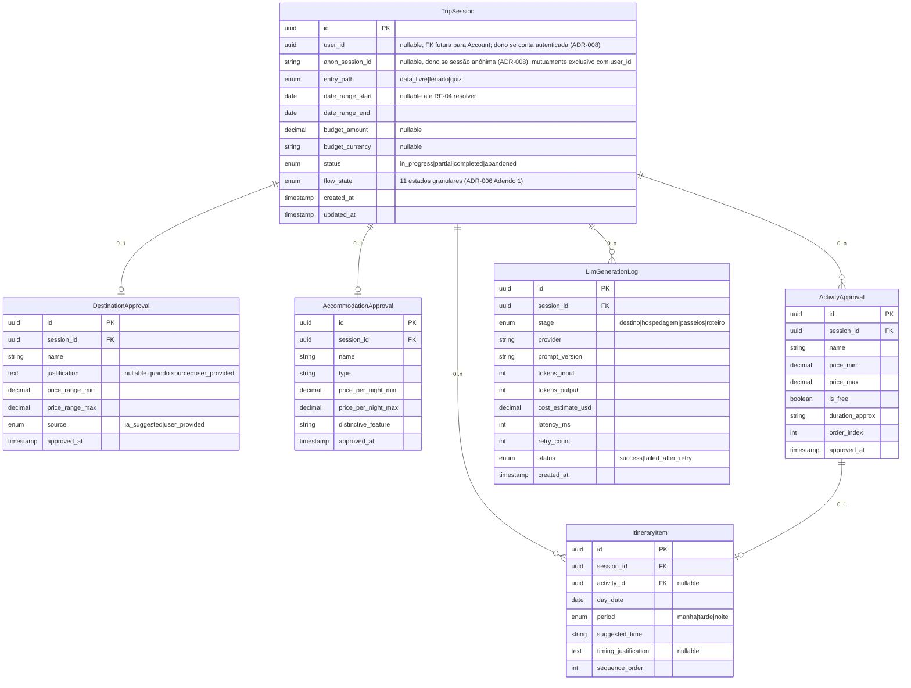
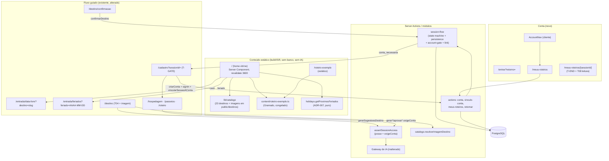

# SDD.md — Planejador de Viagens com Decisão Guiada por IA

Autor: Coordenador (chapéu Software Architect). Baseado em `PRD.md` e
`PRD-TECNICO.md` (2026-09-07), e nas ressalvas do Gate 1 em `CTO-REVIEW.md`.
Cobre exclusivamente o escopo do MVP (Fase 1 — Decisão guiada). O schema de
persistência (Seção 5) é desenhado para ser estendido, não recriado, pela Fase 2.

**Incremento V2.0 (2026-09-16):** a Seção 8 acrescenta a arquitetura do V2.0
("consultor de roteiros": RF-12 a RF-18, RNF-08 a RNF-13, RN-07 a RN-12) e os
ADR-009 a ADR-012. As Seções 1 a 7 continuam valendo para o MVP. A Seção 8
diz explicitamente o que ela altera nelas.

## 1. Visão Geral

O sistema é uma aplicação web responsiva (PWA) de página única por sessão de
planejamento, organizada como um fluxo guiado em etapas (RF-05/RN-01): o usuário
entra por um de três caminhos (RF-01/RF-02/RF-03), o sistema resolve o destino
(sugerido por IA ou confirmado, RF-04/RF-11), e então avança etapa a etapa —
hospedagem (RF-06) → passeios (RF-07) → roteiro (RF-08) — com aprovação ou ajuste
explícito do usuário a cada etapa, nunca mostrando duas etapas na mesma tela.

Arquitetura escolhida: **monólito modular server-rendered**, um único deployable
(aplicação Next.js) com camadas internas bem separadas por responsabilidade.
Justificativa: o MVP tem um único time (o fundador), prazo enxuto e nenhuma
integração de preço real (PRD.md Seção 4) — um monólito modular entrega o
isolamento de responsabilidade necessário (orquestração de fluxo, gateway de LLM,
persistência, cálculo de feriado) sem o custo operacional de múltiplos serviços,
que não se paga neste estágio. Este é o mesmo raciocínio que já levou a cortar
integração de preço real do MVP (PRD.md Seção 4): reduzir superfície antes de
validar a proposta de decisão guiada.

Padrão arquitetural interno: separação em 4 camadas dentro do monólito —
**Apresentação** (UI + componentes de fluxo), **Orquestração de Sessão** (state
machine do fluxo em etapas, RN-01/RF-05), **Gateway de IA** (prompt design,
provider, fallback, validação de plausibilidade — ver Seção 4, ADR-002/003/004),
e **Persistência** (schema estruturado, Seção 5). Cada camada é um módulo isolado
com fronteira de import explícita (nenhuma tela chama o provider de LLM
diretamente; toda chamada passa pelo Gateway de IA).

## 2. Componentes e Fluxo de Dados

```mermaid
flowchart TD
    subgraph Cliente["Apresentação (Next.js App Router + React)"]
        UI[Telas do fluxo guiado]
        SW[Service Worker / PWA]
    end

    subgraph Servidor["Aplicação Next.js (Route Handlers / Server Actions)"]
        Orq[Orquestrador de Sessão\n(state machine de etapas)]
        Gateway[Gateway de IA\n(prompt build + validação + retry)]
        Feriados[Módulo de Feriados\n(determinístico, sem LLM)]
        Persist[Camada de Persistência\n(Prisma ORM)]
    end

    subgraph Externo["Serviços Externos"]
        LLM[Provider de LLM\n(ver ADR-002)]
        DB[(PostgreSQL gerenciado)]
    end

    UI --> Orq
    Orq --> Feriados
    Orq --> Gateway
    Gateway -->|prompt por etapa + JSON schema| LLM
    LLM -->|resposta estruturada| Gateway
    Gateway -->|sugestão validada| Orq
    Orq --> Persist
    Persist --> DB
    Orq --> UI
    SW -.cache de assets estáticos.-> UI
```

Fluxo de dados por etapa (destino/hospedagem/passeios/roteiro): a UI dispara uma
ação de servidor → o Orquestrador de Sessão valida em que etapa a sessão está e
monta o contexto (dados já aprovados, orçamento, destino, datas) → o Gateway de
IA constrói o prompt específico da etapa (ADR-003), chama o provider com saída
estruturada (JSON mode/function calling), valida plausibilidade de preço
(ADR-003) e aplica retry único em falha (ADR-004, RNF-05) → o resultado validado
volta ao Orquestrador, que persiste o estado da sessão (Seção 5) e devolve à UI
para renderização, com streaming quando disponível (Seção 3, RNF-02).

## 3. Stack Tecnológica

| Camada | Escolha | Justificativa |
|---|---|---|
| Frontend/Framework | Next.js 14+ (App Router), TypeScript, React Server Components + Server Actions | Um único framework cobre apresentação e backend leve do MVP, reduzindo superfície operacional; suporte nativo a streaming de resposta (necessário para RNF-02 com chamadas de LLM); ecossistema maduro para PWA |
| PWA / Responsividade | Web App Manifest + Service Worker (`next-pwa` ou implementação nativa equivalente), design responsivo mobile-first | Resolve RNF-04 (desktop + mobile via navegador) sem o custo de build/distribuição de app nativo; ver ADR-001 para a decisão completa PWA vs. nativo |
| Estilização / Design System | Tailwind CSS + shadcn/ui (componentes acessíveis, customizáveis) como base do design system do `UX-SPEC.md` | Suporta o requisito de "visual cuidado" de primeira classe (RNF-03/R11) com velocidade de implementação compatível com o prazo enxuto do MVP; shadcn/ui já resolve boa parte da acessibilidade base (WCAG) exigida |
| Backend | Route Handlers/Server Actions do próprio Next.js (sem serviço backend separado) | Evita duplicar camada de API para um único deployable; mantém o monólito modular da Seção 1 |
| ORM / Persistência | Prisma ORM sobre PostgreSQL gerenciado (ex.: Neon/Supabase — provedor específico é decisão de infraestrutura, não de arquitetura) | Schema relacional se encaixa bem na estrutura de RF-09 (campos opcionais por etapa aprovada); Prisma dá migração versionada, necessária para a Fase 2 estender o schema sem recriá-lo |
| Provider de LLM | Ver ADR-002 | Decisão de arquitetura de primeira classe, conforme ressalva 1 do Gate 1 em `CTO-REVIEW.md` |
| Autenticação | NextAuth.js (ou equivalente), e-mail/senha ou magic link — conta opcional no MVP | Suficiente para RNF-06 (LGPD) sem exigir provedor social de terceiros ainda não decidido; sessão de planejamento funciona mesmo sem conta (ver Seção 5) |
| Cálculo de feriados | Lógica determinística interna (biblioteca de feriados nacionais BR ou tabela própria versionada), sem chamada a LLM | Atende RNF-07 diretamente; feriados nacionais BR são um domínio fechado e conhecido, não exige geração |
| Hospedagem/Deploy | Plataforma serverless compatível com Next.js (ex.: Vercel) | Reduz operação de infraestrutura no MVP; mesma família de escolha já validada no precedente de PWA citado no PRD.md |

## 4. Decisões Arquiteturais (Índice de ADRs)

Todos os ADRs completos estão em `.md/adr/`. Um ADR nunca é editado após aceito —
mudança de decisão gera novo ADR com `Status: Superseded by ADR-NNN`.

| ADR | Título | Decisão resumida |
|---|---|---|
| [ADR-001](adr/001-pwa-web-responsivo-vs-nativo.md) | PWA/web responsivo vs. abordagem nativa | Adota PWA (Next.js), rejeita nativo/híbrido para o MVP |
| [ADR-002](adr/002-provider-llm-e-estrategia-de-custo.md) | Provider de LLM e estratégia de custo | Adota OpenAI GPT-4o-mini com saída estruturada (JSON mode) como provider único do MVP |
| [ADR-003](adr/003-arquitetura-de-prompt-e-mitigacao-de-alucinacao.md) | Arquitetura de prompt e mitigação de alucinação | Prompt por etapa, contexto acumulado, validação de faixa de preço plausível, grounding de data/calendário |
| [ADR-004](adr/004-fallback-e-resiliencia-de-chamadas-llm.md) | Fallback e resiliência de chamadas ao provider de LLM | Retry único automático (RNF-05), sem fallback multi-provider no MVP |
| [ADR-005](adr/005-schema-persistencia-estruturada-rf09.md) | Schema de persistência estruturada (RF-09) | Modelo relacional normalizado por etapa aprovada, campos opcionais, extensível pela Fase 2 |
| [ADR-006](adr/006-orquestracao-de-fluxo-em-etapas-state-machine.md) | Orquestração do fluxo em etapas | State machine explícita server-side, persistida a cada transição |
| [ADR-007](adr/007-calculo-deterministico-de-feriados.md) | Cálculo de feriados nacionais | Lógica determinística interna, sem chamada a LLM |
| [ADR-008](adr/008-propriedade-e-autorizacao-de-trip-session.md) | Propriedade (dono) de `TripSession` e resolução de identidade | Novo campo `anon_session_id`; dono gravado no momento da criação (cookie anônimo ou `user_id`); guard de autorização sempre retorna 404 em divergência. **Itens 4 e 5 substituídos pelo ADR-009** (V2.0); os itens 1 a 3 continuam valendo |
| [ADR-009](adr/009-vinculo-de-sessao-anonima-e-verificacao-de-conta.md) | Vínculo da sessão anônima à conta e verificação de conta no servidor (V2.0) | Pré-condição `transicaoExigeConta` sem mudar a state machine; guard com identidade em par (conta + cookie) e `exigeConta`; vínculo explícito, atômico e idempotente só da sessão indicada; remoção de `/api/gateway-ia/[etapa]` |
| [ADR-010](adr/010-catalogo-de-destinos-e-estrategia-de-imagens.md) | Catálogo de destinos e estratégia de imagens (V2.0) | Catálogo em módulo TS versionado + imagens em `public/`; correspondência exata após normalização; fallback por hash FNV-1a numa paleta pré-verificada; `next/image` sem `remotePatterns` |
| [ADR-011](adr/011-home-vitrine-estatica-e-conteudo-congelado.md) | Home vitrine estática e conteúdo congelado (V2.0) | Home estática com ISR de 1 h, sem sessão no servidor; feriados por função pura; roteiro de exemplo (Gramado) exportado uma vez e versionado; fronteira de import verificada por lint |
| [ADR-012](adr/012-registro-de-consentimento-no-cadastro.md) | Registro de consentimento no cadastro (V2.0) | `User.privacyConsentAt` + `privacyConsentVersion`; texto versionado em código; cadastro por Server Action; remoção de `POST /api/auth/signup` |

## 5. Modelo de Dados de Alto Nível

Schema relacional (PostgreSQL via Prisma), desenhado para satisfazer RF-09.1
(campos independentemente opcionais por etapa aprovada) e para ser estendido —
não recriado — pela Fase 2 (RF-09 depende disso, conforme PRD.md Seção 7,
pergunta 2, e INT-03 do PRD-TECNICO.md).



Notas de design:
- `TripSession` é a raiz de agregação; cada uma das quatro entidades de etapa
  (`DestinationApproval`, `AccommodationApproval`, `ActivityApproval`,
  `ItineraryItem`) só existe quando a etapa correspondente foi aprovada — reflete
  diretamente RN-03 (sessão "concluída com valor" com só uma etapa aprovada).
- ADR-006 Adendo 2 (2026-09-10): a state machine (`SessionFlowAction`) ganhou
  uma ação regressiva `revisar`, que leva um estado `*_confirmado`/
  `*_aprovada(o)`/`*_aprovados` de volta ao `*_pendente` da mesma etapa (ex.:
  `destino_confirmado` → `destino_pendente`). Como `DestinationApproval`/
  `AccommodationApproval` são 0..1 por sessão e `ActivityApproval`/
  `ItineraryItem` são o conjunto de linhas da própria etapa, não existe
  tabela de histórico de aprovação — `revisar` apaga a(s) linha(s) de
  aprovação só da etapa reaberta (nunca de etapa anterior) na mesma
  transação que grava o novo `flow_state`; nenhum campo/enum novo é
  necessário. Detalhe completo no ADR.
- `LlmGenerationLog` não é requisito funcional do PRD-TECNICO.md, mas é
  necessário para operar a mitigação de custo/alucinação exigida pela ressalva 1
  do Gate 1 (observabilidade de custo por chamada e taxa de retry) — registrado
  aqui como decisão de arquitetura, não como escopo de produto novo.
- Extensão prevista pela Fase 2 (fora deste MVP, documentada só para não quebrar
  a herança): tabelas `Checklist`, `TripDocument`, `Expense`, `TripMember`
  referenciando `TripSession.id` como FK — nenhuma delas é criada neste SDD.md.
- `user_id` é nullable porque o fluxo de decisão guiada (RF-01 a RF-11) não exige
  conta criada — só é usado quando o usuário opta por persistir/recuperar sessão
  entre dispositivos (ver Seção 7, RNF-06).
- `flow_state` (enum `SessionFlowState`, 11 valores, default
  `entrada_selecionada`) foi acrescentado a `TripSession` pelo ADR-006 Adendo 1
  (`.md/adr/006-orquestracao-de-fluxo-em-etapas-state-machine.md`) para
  persistir o estado granular da state machine do Orquestrador de Sessão
  (`src/lib/session-flow/state-machine.ts`, L4-T01/L4-T02). Coexiste com
  `status` (`TripSessionStatus`, 4 valores): `status` permanece a
  granularidade grosseira para filtros administrativos e para o estado
  `abandoned` (fora do vocabulário da state machine); `flow_state` é a fonte
  de verdade das 11 etapas, sincronizada com `status` só nos dois terminais
  (`concluida` → `completed`, `encerrada_parcial` → `partial`). Ver o ADR
  para o detalhamento completo.
- `anon_session_id` (ADR-008, `.md/adr/008-propriedade-e-autorizacao-de-trip-session.md`)
  foi acrescentado a `TripSession` para resolver o Bloqueio 004
  (`.md/BLOCKERS.md`): `user_id` existia no schema desde L1-T02, mas nunca era
  de fato gravado por nenhum ponto de criação real, e não havia nenhum campo
  equivalente para sessão anônima — sem isso, o guard de autorização de
  `L11-T02` (Seção 7) não tinha contra o que comparar. `anon_session_id` e
  `user_id` são mutuamente exclusivos na prática (sessão anônima vs.
  autenticada), gravados uma única vez no momento da criação
  (`createSessionWithDateRange`), sem `CHECK` constraint formal — a garantia é
  de responsabilidade do único ponto de criação real, reforçada em tempo de
  compilação pelo tipo `owner` discriminado. Ver o ADR para a regra completa
  de resolução de dono (precedência: conta autenticada > cookie anônimo).

## 6. Riscos Técnicos

| Risco | Severidade | Mitigação / decisão | Dívida técnica aceita |
|---|---|---|---|
| Alucinação de preço/informação pela LLM (R-01 do PRD.md) | Alta | ADR-003: saída estruturada + validação de faixa plausível server-side + rotulagem "faixa aproximada" (RNF-01, tratado no UX-SPEC.md) | Não há verificação factual contra fonte externa real (ex.: preço real de ingresso) — aceito conscientemente, pois integração de preço real está fora do MVP (PRD.md Seção 4); mitigado por disclaimer explícito no roteiro final |
| Custo por chamada de LLM não controlado (sem modelo de monetização definido, R-04 do PRD.md) | Média | `LlmGenerationLog` (Seção 5) dá observabilidade de custo desde o dia 1; limite de chamadas por sessão não implementado no MVP | Aceito: limite de uso por usuário fica para quando o modelo de monetização for decidido (R-04, fora do MVP) |
| Latência de chamada de LLM quebrando a percepção de fluidez do fluxo guiado (RNF-02) | Média | Streaming de resposta via Server Actions + skeleton state; meta de p95 ≤ 8s por etapa, com primeiro conteúdo perceptível em até 2s via streaming | — |
| Retry único (ADR-004) insuficiente em instabilidade prolongada do provider | Baixa/Média | RNF-05 exige só uma tentativa adicional antes de expor erro; estado de erro explícito com CTA de "tentar novamente" manual coberto no UX-SPEC.md | Aceito para o MVP: fallback multi-provider é over-engineering sem uso real que justifique o custo adicional |
| Schema de persistência (Seção 5) não antecipar corretamente uma necessidade real da Fase 2 | Média | Schema revisado deliberadamente contra RF-09.1 e a Pergunta em Aberto 2 do PRD.md; qualquer gap real só aparecerá ao especificar o PRD-TECNICO.md da Fase 2 | Aceito: não é possível eliminar 100% o risco de retrabalho de schema sem especificar a Fase 2 agora, o que contradiz a priorização do PRD.md (Fase 1 antes de Fase 2) |
| Monólito único concentra toda a carga (apresentação + orquestração + gateway de IA) num só deployable | Baixa | Aceitável para o volume esperado de um MVP recém-lançado (PRD.md Seção 3, meta de conclusão de fluxo, não de escala); camadas internas já isoladas (Seção 1) facilitam extração futura se necessário | Aceito conscientemente; extração para serviços separados só se justifica com evidência real de gargalo |

## 7. Requisitos de Segurança

- **Autenticação**: conta opcional (NextAuth.js), obrigatória apenas para
  recuperar sessão entre dispositivos; sessão de planejamento em andamento
  funciona sem login, usando identificador de sessão assinado (cookie
  httpOnly + secure).
- **Autorização**: toda leitura/escrita em `TripSession` e entidades filhas exige
  que o identificador de sessão (cookie) ou `user_id` autenticado corresponda ao
  dono do registro; nenhuma rota expõe `TripSession` de outro usuário/sessão.
  O dono é gravado explicitamente no momento da criação da `TripSession`
  (`user_id` se autenticado, `anon_session_id` se anônimo — mutuamente
  exclusivos, precedência de conta autenticada sobre cookie anônimo quando
  ambos presentes na requisição de criação) e comparado pelo guard central
  contra a identidade resolvida da requisição corrente a cada leitura/escrita
  subsequente; qualquer divergência (incluindo registro sem dono gravado)
  retorna **404, nunca 403**, para não revelar a existência do registro a um
  solicitante ilegítimo. Ver ADR-008
  (`.md/adr/008-propriedade-e-autorizacao-de-trip-session.md`) para o
  detalhamento completo.
- **Criptografia**: TLS obrigatório em todo tráfego (cliente-servidor e
  servidor-provider de LLM); dados pessoais em repouso (e-mail de conta, quando
  aplicável) armazenados com criptografia em nível de coluna/disco do provedor
  gerenciado de PostgreSQL; segredos (API key do provider de LLM, string de
  conexão do banco) mantidos em variáveis de ambiente/secrets manager da
  plataforma de deploy, nunca versionados no repositório.
- **Isolamento**: dados enviados ao provider de LLM ficam restritos ao contexto
  necessário da sessão (datas, destino, orçamento, feedback do usuário) — nenhum
  dado pessoal de conta (e-mail, senha) é enviado ao prompt em nenhuma etapa.
- **LGPD (RNF-06)**: coleta mínima de dado pessoal (e-mail, quando conta é
  criada); finalidade declarada (recuperar sessão); mecanismo de exclusão de
  conta e dados associados previsto como requisito de implementação (detalhado
  no TASK.md); nenhum dado pessoal é usado para treinar/fine-tunar modelo — só
  passa por inferência via API do provider.
- **Rate limiting**: limite de chamadas ao Gateway de IA por sessão/IP no nível
  de aplicação, para conter abuso e custo (complementa o risco de custo não
  controlado da Seção 6), mesmo sem modelo de monetização definido ainda.
- **Validação de entrada**: toda entrada de usuário (range de datas, orçamento,
  texto livre do quiz) validada e sanitizada no servidor antes de compor o
  prompt, mitigando prompt injection via campo de texto livre de orçamento
  (RF-03.1 item 4).
- Nota explícita: os itens acima definem o requisito de arquitetura de
  segurança; SAST/DAST/hardening tático é responsabilidade do Validador na fase
  de execução, não deste documento.

---

## 8. Incremento V2.0 — "consultor de roteiros de viagem" (2026-09-16)

Autor: Coordenador (chapéu Software Architect). Entrada: `PRD.md` §4 ("Plano
do V2", "Catálogo do V2.0") e `PRD-TECNICO.md` (RF-12 a RF-18, RNF-08 a
RNF-13, RN-07 a RN-12, INT-06 a INT-16). A estrutura repete a das Seções 1
a 7. O que não é citado aqui continua valendo.

### 8.1 Visão Geral do V2.0

O monólito modular da Seção 1 continua o mesmo: nenhum serviço novo,
nenhuma integração externa em tempo de execução, nenhuma chamada nova de
IA. O V2.0 acrescenta três coisas:

1. **Uma camada de conteúdo estático** (home vitrine, catálogo de destinos e
   roteiro de exemplo), servida sem banco e sem IA (ADR-010, ADR-011).
2. **Um corte de acesso por etapa**: o trecho até a confirmação do destino é
   anônimo, e o resto exige conta, verificada no Orquestrador de Sessão como
   pré-condição de transição (ADR-009). O corte inclui o vínculo da sessão
   anônima à conta e o registro de consentimento (ADR-012).
3. **Uma leitura por conta**: "meus roteiros" e a retomada de sessão.

A state machine (ADR-006 e adendos) **não muda**. Nenhum estado, ação ou
transição é acrescentado.

### 8.2 Componentes e Fluxo de Dados (V2.0)



#### 8.2.1 Home vitrine (RF-12, RN-08; ADR-011)

- `src/app/page.tsx` passa a ser a home vitrine e **substitui T00**. O
  conteúdo de T00 (`ENTRY_PATHS`) é reaproveitado como a seção "Três jeitos
  de começar" (`id="caminhos"`). A página é um Server Component estático
  (`revalidate = 3600`) que não lê cookies nem sessão.
- Seções em `src/components/home/`, na ordem do RF-12.1: `HeroSection`,
  `EntryPathsSection`, `HowItWorksSection`, `ShowcaseSection`
  (`ShowcaseCard` × 8), `ExamplePreviewSection`, `UpcomingHolidaysSection`,
  `FaqSection`, e o rodapé com `ImageCreditsSection`. `MobileStickyCta` é o
  único componente cliente da página: um `IntersectionObserver` sobre o
  hero (RF-12.6).
- "Montar minha viagem" é um link para `/#caminhos`, e o foco vai para o
  título da seção (RF-12.4/INT-06). "Ver roteiro de exemplo" é um link para
  `/roteiro-exemplo` (RF-12.5).
- Nenhum import de Gateway de IA, `stage-rules` ou Prisma nesses arquivos,
  garantido por regra de lint e por teste (ADR-011 item 5).

#### 8.2.2 Catálogo e imagem do destino (RF-15, RN-10; ADR-010)

- `src/lib/catalogo/destinos.ts` (dados), `resolver-imagem.ts`
  (normalização, correspondência exata e fallback) e `public/destinos/*`
  (arquivos).
- **T04**: `gerarSugestoesDestino` acrescenta `imagem` a cada sugestão
  **depois** do Gateway, só para apresentação. Esse campo é ignorado ao
  aprovar. Prompt e schema do Gateway não mudam.
- `SuggestionCard` recebe uma prop opcional `media`
  (`ImagemResolvida | undefined`). T06 e T07 continuam sem imagem no V2.0,
  porque a faixa visual em todas as etapas é do V2.1.
- Componente cliente `DestinationImage`: usa `next/image` e troca para
  `DestinationFallbackArt` no `onError` (RF-15.9).
- `next.config.mjs`: `images.formats` avif/webp, `minimumCacheTTL`
  alto, **sem `remotePatterns`**, e o cabeçalho `Referrer-Policy` (ver
  §8.7).

#### 8.2.3 Roteiro de exemplo (RF-14; ADR-011)

- Destino escolhido: **Gramado (RS)**, fim de semana de 3 dias. O motivo
  está no `UX-SPEC.md` §8.2 (T-EX).
- `src/content/roteiro-exemplo.ts`, exportado uma vez por
  `scripts/exportar-roteiro-exemplo.ts` a partir de uma sessão real
  concluída em desenvolvimento, revisado e congelado. Ele usa os tipos
  `RoteiroDayResult`/`RoteiroItemResult` para que `ItineraryDayBlock` o
  renderize sem adaptação.
- A rota `/roteiro-exemplo` é estática. O CTA "Planejar minha viagem para
  Gramado" leva a `/entrada/data-livre?destino=gramado` (RF-14.4).

#### 8.2.4 Entradas pré-preenchidas (RF-13, RF-18.3)

- **T01** `/entrada/data-livre?destino={slug}`: a página vira um Server
  Component fino que resolve o `slug` no catálogo e passa
  `destinoInicial = "{nome}, {UF}"` ao formulário, que passa a ser um
  componente cliente. Um `slug` desconhecido é ignorado sem erro, e o campo
  fica vazio. **Só `slug` é aceito na URL**, nunca texto livre, para não
  refletir conteúdo arbitrário vindo de link externo. As datas ficam
  vazias (RF-13.3). O envio continua em `submeterDataLivre`, com a
  sanitização atual. Destino mantido leva a `destino_confirmado` e T05;
  destino apagado leva a `destino_pendente` e T04 (RF-13.4/13.5). Nenhuma
  lógica nova no servidor.
- **T02** `/entrada/feriados?feriado=AAAA-MM-DD`: `FeriadosPage` procura a
  data na lista de `getFeriadosProlongados()` pela chave de data. Se
  encontrar, passa `feriadoInicialKey` para `FeriadosScreen`, que deixa o
  item selecionado, rola até ele e o anuncia. Valor inválido é ignorado. O
  avanço continua exigindo o clique do usuário (INT-10).
- **Home, feriados**: `getProximosFeriados(hojeSaoPaulo, 3)` reaproveita o
  mesmo cálculo (RF-18.1/18.2).

#### 8.2.5 Gate de cadastro, vínculo e verificação de conta (RF-16; ADR-009)

**Verificação no servidor.** A função pura `transicaoExigeConta` alimenta
`applySessionFlowTransition`, e `assertSessionAccess(..., { exigeConta })`
protege as leituras que chamam o provider.

| Server Action / rota | Transição ou leitura | Exige conta? |
|---|---|---|
| `submeterDataLivre`, `processarFeriadoEscolhido`, `submitQuizAnswers` | cria sessão; `iniciar`/`aprovar` destino | Não |
| `gerarSugestoesDestino` | leitura + IA de destino | Não |
| `aprovarDestinoSugerido`, `informarDestinoManualmente` | `aprovar` (destino) | Não |
| `trocarDestino` | `revisar` a partir de `destino_confirmado` | Não |
| `encerrarResolucaoDestino` e os demais `encerrar*` | `encerrar` (qualquer estado) | **Não** (RN-12) |
| `obterResumoEncerramento` (`/encerramento`) | leitura | Não |
| **`confirmarDestino`** | `avancar` → `hospedagem_pendente` | **Sim**; se anônimo, devolve `conta_necessaria` e o estado continua `destino_confirmado` |
| `gerarSugestoesHospedagem`, `aprovarHospedagem` | leitura + IA / `aprovar` + `avancar` | **Sim** |
| `gerarSugestoesPasseios`, `aprovarPasseios` | idem | **Sim** |
| `gerarRoteiro`, `aprovarRoteiro` | idem | **Sim** |
| `retomarSessao` (§8.2.7) | `avancar` de estado `*_aprovad*` | **Sim**, se a sessão já passou do destino |
| `obterRoteiroLeitura` (`/meus-roteiros/[sessionId]`) | leitura | **Sim** |
| `POST /api/gateway-ia/[etapa]` | IA sem sessão | **Removida** (ADR-009 item 5) |

As telas T06, T07 e T08 tratam `conta_necessaria` navegando para
`/cadastro?sessionId=...`. Isso cobre sessões anônimas antigas (RF-16.9) e
acesso direto por URL.

**Sequência de cadastro a partir de T05** (anônimo):

```mermaid
sequenceDiagram
    actor U as Usuário
    participant T05 as T05 (cliente)
    participant SA as Server Actions
    participant NA as NextAuth (/api/auth/*)
    participant DB as PostgreSQL
    U->>T05: Confirmar e continuar
    T05->>SA: confirmarDestino(sessionId)
    SA->>DB: posse OK (cookie) · transicaoExigeConta = true · sem conta
    SA-->>T05: {status: "conta_necessaria"}
    T05->>U: /cadastro?sessionId=… (estado continua destino_confirmado)
    U->>SA: criarConta(email, senha, consentimento=true)
    SA->>DB: INSERT users (+ privacy_consent_at/version)
    SA-->>U: {status: "ok"}
    U->>NA: signIn("credentials", redirect:false) [token CSRF do NextAuth]
    NA-->>U: cookie de sessão (JWT)
    U->>SA: vincularSessaoAConta(sessionId)
    SA->>DB: TX: UPDATE … WHERE id AND anon_session_id=cookie AND user_id IS NULL; avancar → hospedagem_pendente
    SA-->>U: {rota: "/hospedagem?sessionId=…"}
    U->>U: navega para T06
```

- **"Já tenho conta"**: `signIn` seguido de `vincularSessaoAConta`, com a
  mesma sequência a partir do `signIn`.
- **Gate aberto por quem já está autenticado** (outra aba ou sessão
  antiga): a tela mostra "Continuar com a conta {e-mail}", e o vínculo só
  acontece depois desse clique. Nunca no carregamento (GET sem efeito
  colateral).
- **Falhas parciais**:
  - conta criada, mas `signIn` falhou: a tela troca para "entrar" com o
    e-mail preenchido;
  - `signIn` ok, mas o vínculo falhou: a tela mostra erro com "Tentar
    novamente". O vínculo é idempotente, e a sessão continua anônima e
    intacta (RF-16.8).
- **Desistir** (RF-16.5): chama `encerrarResolucaoDestino` (permitido sem
  conta) e leva a `/encerramento?flowState=encerrada_parcial`. **Voltar**
  retorna a T05 sem escrita, porque o estado continua `destino_confirmado`.
- **Concorrência**: o `UPDATE` condicional garante que só uma requisição
  vincula. As outras recebem sucesso idempotente (mesma conta) ou 404
  (qualquer outro caso). Uma geração de destino em andamento durante o
  vínculo não é afetada: depois dele, a identidade autenticada é a dona.
  Cadastros simultâneos com o mesmo e-mail são resolvidos pela restrição
  única (`P2002` vira "e-mail já cadastrado").
- **Cookie anônimo depois do vínculo**: mantido, sem troca (ADR-009 item 4).
  Como `anon_session_id` foi zerado na sessão vinculada, esse cookie não a
  abre mais.
- **`retorno` e `callbackUrl`**: só são aceitos caminhos relativos de uma
  lista permitida (`/meus-roteiros`, `/hospedagem`, `/passeios`, `/roteiro`,
  `/destino/confirmacao`), que começam com `/` e não com `//`. Qualquer outro
  valor vira `/`, para impedir redirecionamento aberto.

`rotaDaEtapa(flowState, sessionId, destino?)`, função pura em
`src/lib/session-flow/rotas.ts` e fonte única do mapeamento estado → tela,
usada pelo vínculo, por `retomarSessao` e por "meus roteiros":

| `flowState` | Rota |
|---|---|
| `entrada_selecionada`, `destino_pendente` | `/destino?sessionId` |
| `destino_confirmado` | `/destino/confirmacao?sessionId&destino&flowState` |
| `hospedagem_pendente` | `/hospedagem?sessionId` |
| `passeios_pendente` | `/passeios?sessionId` |
| `roteiro_pendente` | `/roteiro?sessionId` |
| `hospedagem_aprovada`, `passeios_aprovados`, `roteiro_aprovado` | transitórios: `retomarSessao` aplica `avancar` antes e usa a rota do estado seguinte |
| `concluida`, `encerrada_parcial` | `/meus-roteiros/[sessionId]` (com conta) ou `/encerramento?sessionId&flowState` (sem conta) |

Os estados `*_aprovad*` são transitórios porque, no MVP, `aprovarHospedagem`,
`aprovarPasseios` e `aprovarRoteiro` executam `aprovar` e `avancar` em duas
transações. Se a segunda falhar, a sessão fica parada nesse estado.

#### 8.2.6 Cadastro e consentimento (RNF-13; ADR-012)

- Server Action `criarConta({ email, senha, consentimento })`. Só e-mail e
  senha, sem nome. A política de senha continua a de `user-account.ts`, com
  mínimo de 8 caracteres.
- O consentimento é validado no servidor antes de qualquer consulta.
  `privacyConsentAt` usa o relógio do servidor, e `privacyConsentVersion` usa
  a constante versionada.
- `POST /api/auth/signup` é removida. A entrada continua pelo NextAuth
  Credentials atual, sem provider novo (INT-14).
- `authorize` do Credentials passa a ter limite de tentativas (§8.7) e tempo
  de resposta equalizado: quando o e-mail não existe, o `bcrypt.compare` roda
  contra um hash fixo.
- **Fora do V2.0**, por falta de provedor de e-mail: recuperação de senha e
  verificação de e-mail. Ver §8.6 e o ponto de decisão do dono.

#### 8.2.7 "Meus roteiros" e retomada (RF-17)

- `/meus-roteiros` é um Server Component dinâmico. `getServerSession`; sem
  conta, redireciona para `/entrar?retorno=/meus-roteiros` (RF-17.7).
- `listarMeusRoteiros()` faz `tripSession.findMany({ where: { userId },
  orderBy: { updatedAt: "desc" }, select: { id, flowState, dateRangeStart,
  dateRangeEnd, updatedAt, destinationApproval: { select: { name } },
  accommodationApproval: { select: { id } }, _count: { select: {
  activityApprovals } } } })`.
  - **O `userId` vem só da sessão do servidor**, nunca de parâmetro
    (RF-17.8).
  - Usa o índice `(user_id, updated_at)`.
  - Não há paginação no V2.0. A lista traz todas as sessões (RF-17.2), e a
    dívida está registrada em §8.6.
- **Rótulo** (RF-17.3), função pura `rotuloDaSessao`:
  - `concluida` → "Roteiro concluído";
  - `encerrada_parcial` → "Encerrada em {etapa}", em que etapa é a última
    aprovada: passeios, se há `ActivityApproval`; senão hospedagem, se há
    `AccommodationApproval`; senão destino;
  - demais estados → "Em andamento — na etapa {destino | hospedagem |
    passeios | roteiro}", pelo prefixo do `flowState` (`entrada_selecionada`
    conta como destino).
- **Continuar** (RF-17.4): Server Action `retomarSessao(sessionId)`:
  1. faz `assertSessionAccess`, com conta exigida se o estado já passou do
     destino;
  2. se o estado é `*_aprovad*`, aplica `avancar` pelo Orquestrador. Não é
     transição nova: é a que o MVP já faz depois de aprovar;
  3. devolve `rotaDaEtapa`.

  Ela é um POST disparado pelo clique, não um GET com efeito colateral.
- **Ver** (RF-17.5): `/meus-roteiros/[sessionId]` exige conta dona e lê
  `obterResumoEncerramento` e `obterRoteiroLeitura`. Esta última é nova: lê
  `ItineraryItem` ordenado por `dayDate`, `period` e `sequenceOrder`, junto
  com o `ActivityApproval` relacionado, **sem IA**, e renderiza
  `ItineraryDayBlock` em modo leitura. Qualquer divergência de posse
  redireciona para `/meus-roteiros` (404 lógico).
- **Excluir conta**: um botão em "meus roteiros" chama o `DELETE
  /api/account` já existente e depois `signOut`. O RNF-13 manda a tela de
  cadastro dizer que a conta pode ser excluída, e só a API existia. Ver o
  ponto de decisão em §8.6.
- `AccountNav` (cliente, no layout): mostra "Meus roteiros" e "Sair" com
  conta, e "Entrar" sem conta (RF-17.1).

### 8.3 Stack Tecnológica (alterações do V2.0)

| Camada | Mudança | Justificativa |
|---|---|---|
| Autenticação | A linha "e-mail/senha ou magic link — conta opcional" da Seção 3 passa a ser **"NextAuth v4 Credentials (e-mail/senha); conta obrigatória a partir da hospedagem"** | INT-14, RN-09. Magic link exigiria provedor de e-mail |
| Cliente de auth | `next-auth/react` (`signIn`, `signOut`, `getSession`) nas telas de conta e no `AccountNav`, **sem `SessionProvider` global** | O v4 não tem `signIn` no servidor para Credentials. O `signIn` do cliente já trata o token CSRF do NextAuth. Sem provider global, o layout continua estático |
| Imagens | `next/image` com arquivos locais | RNF-12; já incluso no Next 15, sem dependência nova |
| Fontes | `next/font/google` para Cormorant Garamond (400/500/600) e Work Sans (400/500/600), auto-hospedadas, `display: swap`, com a fonte display pré-carregada | RNF-08/RNF-12. Evita requisição a terceiros e o deslocamento de layout na troca de fonte |
| Dependências novas | **Nenhuma** | FNV-1a, normalização e observador de interseção são código próprio ou nativo |
| Removido | `POST /api/auth/signup`, `POST /api/gateway-ia/[etapa]` | ADR-012 e ADR-009 |

### 8.4 Decisões Arquiteturais do V2.0

ADR-009 a ADR-012, indexados na Seção 4. O ADR-009 substitui os itens 4 e
5 do ADR-008. Os ADR-001 a ADR-007 não mudam.

### 8.5 Modelo de Dados (V2.0)

Migration única e aditiva `YYYYMMDDHHMMSS_v2_consent_and_session_link`:

```prisma
model User {
  // ... inalterado ...
  privacyConsentAt      DateTime? @map("privacy_consent_at")      // ADR-012
  privacyConsentVersion String?   @map("privacy_consent_version") // ADR-012
}

model TripSession {
  // ... inalterado ...
  linkedAt DateTime? @map("linked_at")  // ADR-009: quando a sessão anônima virou da conta
  @@index([userId, updatedAt])          // "meus roteiros"
}
```

- Sem backfill, sem coluna nova obrigatória, sem mudança em enum. A
  migration não trava leitura nem escrita de forma relevante no volume do
  protótipo.
- **Não** foi adicionada FK de `trip_sessions.user_id` para `users`. A
  exclusão de conta já apaga as sessões explicitamente
  (`account-deletion.ts`), e a FK exigiria limpar dados órfãos de
  desenvolvimento. Essa decisão continua a do MVP.
- `linkedAt` permite ler à mão as métricas "cadastro pós-destino" e
  "conclusão pós-cadastro" (`PRD.md`, Métricas do V2), sem instrumentação
  nova.
- **Invariante do ADR-008 mantido**: toda `TripSession` tem exatamente um
  dono. O vínculo troca `anon_session_id` por `user_id` num único `UPDATE`.
- Catálogo e roteiro de exemplo **não** ficam no banco (ADR-010, ADR-011).

### 8.6 Riscos Técnicos (V2.0)

| Risco | Severidade | Mitigação / decisão | Dívida técnica aceita |
|---|---|---|---|
| Vínculo transferir sessão de outra pessoa (escalada entre sessões) | Alta | Posse provada pelo cookie da requisição, `UPDATE` condicional (`anon_session_id` = cookie E `user_id IS NULL`), só a sessão indicada, 404 em divergência, testes de integração dos quatro casos da tabela do ADR-009 | — |
| Endpoint ou ação de etapa pós-destino chamada sem conta, gerando custo de IA | Alta | `transicaoExigeConta` no Orquestrador; `exigeConta: true` antes do prompt em `gerar*`; remoção de `/api/gateway-ia/[etapa]`; teste que chama cada ação sem conta e verifica que o Gateway não foi chamado | — |
| Mudança de semântica do guard quebrar testes e telas do MVP | Média | Alias `assertSessionOwnership` durante a transição; lista de testes que mudam de expectativa no ADR-009; regressão completa dos 12 lotes no fechamento | — |
| Erros de Server Action apagados em produção impedirem a tela de reconhecer "precisa de conta" | Média | Resultado discriminado `conta_necessaria`, nunca exceção para o cliente (ADR-009 item 2) | — |
| Falha entre `signIn` e vínculo deixar o usuário autenticado com sessão ainda anônima | Média | Vínculo idempotente; o gate reconhece o usuário autenticado e oferece "Continuar com a conta"; o guard aceita o dono anônimo autenticado nas leituras | — |
| LCP > 2,5 s no mobile por causa do hero | Média | `priority`, AVIF, `sizes` por breakpoint, fonte display pré-carregada, página estática na borda, arquivo-fonte de até cerca de 600 KB | Sem RUM: só laboratório (INT-13) |
| Foto errada em T04 | Média (confiança) | Igualdade exata, variantes só do mesmo lugar, teste de colisão, fallback em qualquer dúvida | A taxa de acerto não é gravada no V2.0 (ADR-010) |
| Catálogo sem fotos na entrega (curadoria do dono atrasada) | Baixa | `imagem: null` é válido e cai no fallback; a vitrine continua legível com o gradiente | — |
| Rate limit em memória, por instância, contornável | Média | Mantido do MVP, agora também em `authorize` e `criarConta` | **Aceito no protótipo**; limite distribuído é pré-requisito de "colocar no ar de verdade" |
| Sem recuperação de senha e sem verificação de e-mail (dependem de provedor de e-mail) | Média | Mensagem clara na tela de entrada; a conta pode ser excluída | **Aceito no V2.0**, mas é decisão do dono (ver resposta desta rodada). Consequências: quem esquece a senha perde acesso aos roteiros; alguém pode cadastrar um e-mail de outra pessoa |
| "Meus roteiros" sem paginação | Baixa | Uma consulta indexada; o volume por conta no protótipo é pequeno | **Aceito**; paginar quando houver uso real |
| Enumeração de e-mail no cadastro | Baixa/Média | Ver §8.7; a mensagem explícita é exigida pelo RF-16.8 | **Aceito** por requisito |
| JWT válido depois da exclusão de conta | Baixa | `signOut` imediato; `resolveRequestIdentity` confirma que o `User` existe | — |
| Conteúdo do roteiro de exemplo com erro factual | Baixa | Revisão humana antes do commit; rótulo "exemplo" (RF-14.3) | — |

### 8.7 Requisitos de Segurança (V2.0)

Os itens abaixo acrescentam ou alteram a Seção 7:

- **Autenticação**: conta obrigatória a partir da hospedagem, verificada no
  servidor (RF-16.7). O trecho até o destino continua anônimo, com o cookie
  httpOnly/secure do MVP.
- **Autorização** (substitui o parágrafo do guard na Seção 7, conforme
  ADR-009):
  - identidade em par (conta + cookie);
  - negação de posse é sempre 404;
  - a exigência de conta só é avaliada depois da posse e só aparece para o
    próprio dono;
  - "meus roteiros" filtra só pelo `userId` da sessão do servidor.
- **Vínculo**:
  - exige conta autenticada **e** cookie igual ao `anon_session_id` gravado;
  - o `sessionId` do cliente só seleciona;
  - o `UPDATE` é atômico, condicional e idempotente para o mesmo usuário;
  - nunca muda o dono de sessão que já tem conta;
  - nunca vincula em GET.
- **CSRF**:
  - Server Actions com a verificação de origem nativa do Next.js, sem
    `serverActions.allowedOrigins` extra;
  - entrada pelo `signIn` do NextAuth, que usa o token CSRF próprio;
  - rota JSON de cadastro removida;
  - `DELETE /api/account` depende de preflight CORS (método não simples) e
    fica sem `Access-Control-Allow-Origin`.
- **Enumeração de e-mail**:
  - na entrada, mensagem única ("E-mail ou senha incorretos") e tempo
    equalizado;
  - no cadastro, a mensagem explícita de e-mail já cadastrado é exigida pelo
    RF-16.8, e o risco é contido por limite de tentativas: 5 cadastros por
    IP a cada 10 min; 10 tentativas de entrada por par (IP, hash do e-mail) a
    cada 10 min, com o mesmo mecanismo em memória de `rate-limit.ts`;
  - o e-mail nunca é registrado em log.
- **Redirecionamento aberto**: `retorno`/`callbackUrl` só aceitam a lista
  permitida da §8.2.5.
- **Consentimento**: validado no servidor, com data e hora do servidor,
  versão do texto gravada e nenhuma escrita antes do aceite (ADR-012).
- **Parâmetros de URL das telas de entrada**: T01 só aceita `slug` do
  catálogo; T02 só aceita uma data presente na lista calculada. Nenhum texto
  livre de URL chega ao prompt ou à página.
- **Cabeçalhos**: `Referrer-Policy: strict-origin-when-cross-origin` em
  todas as rotas, via `next.config.mjs`, porque o `sessionId` fica na
  querystring e a página tem links de crédito para Unsplash e Pexels. Os
  links externos usam `rel="noopener noreferrer"`.
- **Imagens**: só do próprio domínio, sem `remotePatterns`, sem busca
  externa em tempo de execução e sem imagem gerada por IA (RN-10).
- **LGPD** (RNF-06/RNF-13):
  - coleta só de e-mail e senha;
  - finalidade declarada na tela;
  - sem uso para marketing;
  - exclusão de conta acessível pela interface ("meus roteiros");
  - política de privacidade completa fica fora do V2.0 (pré-requisito de ir
    ao ar de verdade).
- **Custo de IA**:
  - só a etapa de destino roda sem identidade;
  - home e exemplo com zero chamadas (RN-08), garantidas por lint e teste;
  - teto diário global continua fora do V2.0 (decisão do dono).
- A nota final da Seção 7 continua valendo: estes são requisitos de
  arquitetura, e SAST/DAST continuam com o Validador.
